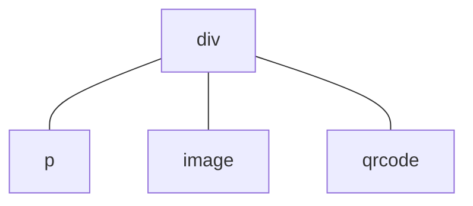

# Framework


================================================================================
# FILE: D:/DT1/web-docs/src/framework/application/applet-object.md
================================================================================

# 应用对象

每个应用中都有一个 `app.ux` 或者 `app.js` 文件。


================================================================================
# FILE: D:/DT1/web-docs/src/framework/application/cross-device.md
================================================================================

# 跨设备适配

当你的应用需要在多种设备商运行时，可能会遇到多种交互兼容性问题，例如：
- 不同设备的屏幕分辨率和尺寸都不相同，应用在不同设备中应该进行适当的布局和缩放；
- 不同设备的系统字体、字号不尽相同，应用程序应遵循系统风格；
- 界面布局要考虑不同的屏幕形状，如圆形屏幕常使用鱼眼变形的列表；
- 不同的屏幕形状和屏幕分辨率下，页面的安全边距可能不同。

本文档介绍怎样在编写较少的适配代码的情况下，通过 Glyphix 应用框架来开发兼容广泛设备的手表应用。

## 模拟器参数

在使用 `gx emu` 命令启动模拟器时，`-d` 或 `--device` 参数可以指定被模拟的设备，例如 `gx emu -d default-watch-466x466` 将会模拟器分辨率为 $466\times 466$ 像素的圆屏设备。`gx emu` 会记住上次 `-d` 指定的设备，而不是自动回退到默认设备。

::: tip
如果你安装了 gx 命令的 PowerShell 或者 Zsh 补全脚本，那么输入 `gx emu -d` 之后就可以通过 `Tab` 键补全可用的设备名称。否则请先使用 `gx list device` 查看设备列表，例如：
``` bash
$ gx list device
default-watch-466x466
default
```
:::

默认情况下，模拟器的屏幕分辨率和实际设备一样，可以通过 `-r` 或 `--real-scale` 参数（`gx emu -r`）来模拟设备的实际屏幕尺寸而不是分辨率。不建议在非高分辨率显示器中使用 `-r` 参数，否则会导致显示过于模糊。

通过 `-d` 和 `-r` 参数就可以通过模拟器来测试多种设备的显示效果，而不必准备物理设备。

## 多分辨率适配

在 Web 开发中，开发者通常依赖媒体查询和 `px` 等单位进行精细的布局和样式调整。然而，在穿戴设备上，不同设备的最佳字号差异过大，难以在开发时精确规划。更重要的是，如何通过统一的视觉规范，确保一款设备中的所有应用具备一致的可读性和操作体验，是穿戴设备 UI 设计的核心问题之一。

以智能手表为例，不同设备的屏幕宽度可能分布在 $360\rm px$ 到 $466\rm px$ 之间，而高度则介于 $450\rm px$ 到 $500\rm px$ 左右。因此尽管存在 [`designWidth`](manifest.md#designwidth) 配置，通常也不能通过 `px` 单位来指定大多数界面元素的尺寸。无论怎样缩放，`px` 单位总会存在这些问题：
- 设备的 DPI 或者尺寸不同，无法通过固定的像素尺寸得到理想的字号；
- 圆形屏幕和矩形屏幕的宽高比差异大，难以通过像素值指定大的填充空隙。

本节将介绍针对这些问题的布局技巧。

### 字号规范

请参考字体规范的 [`rem` 字号单位](font-config.md#rem-字号单位)指南来规范应用中的字号，**不要**使用 `px` 作为字号单位。

### 边距配置

可以使用 `px` 等任何[长度](/framework/render/style-and-layout.md#长度)单位来指定较小的边距值，例如：

``` css
p {
  border: 2px solid gray;
  font-size: 1.25rem;
  padding: 8px; /* 使用 px 作为边距单位 */
  margin: 8px;
}
```

<glyphix id="font-config-margins-pixel" height="80" width="300" inline>

```html
<p>The message text.</p>
```

```css
p {
  border: 2px solid gray;
  font-size: 1.25rem;
  padding: 8px;
  margin: 8px;
}
```

</glyphix>

其中除了 `font-size` 使用了 `rem` 以外，其他几处属性均使用 `px` 单位。这是因为 Glyphix 会为目标设备自动缩放 `px` 单位的比例，且较小的 `px` 值通常没有溢出或者裁剪风险。

但是当尺寸值很大时，更建议建议使用百分比值，例如：

``` css
p {
  border: 2px solid gray;
  font-size: 1.25rem;
  /* 左内边距使用百分比单位，请注意示例文本左侧的边距 */
  padding: 8px 8px 8px 40%;
}
```

<glyphix id="font-config-margins-percent" height="80" width="300" inline>

```html
<p>Message</p>
```

```css
p {
  border: 2px solid gray;
  font-size: 1.25rem;
  padding: 8px 8px 8px 40%;
}
```

</glyphix>

这样可以更好地适配分辨率差异很大的设备。

::: warning
手表设备的屏幕高度差异较大，垂直方向上的大边距需要更加注意兼容性问题。
:::

### flex 布局

除了百分比长度单位以外，flex 布局可以提供更灵活的界面适应能力。应当优先使用 flex 布局，然后才是百分比长度单位。并应该避免手动布局，即直接指定元素的 `width` 和 `height` CSS 属性。

应该进行手动布局的一种例外情况是显示网络图标的界面，例如：
``` html
<scroll>
  <div class="item" for="item in items">
    <image :src="item.icon" />
    <p>{{ item.title }}</p>
  </div>
</scroll>
```
如果说 `item.icon` 指向的图片尺寸并不固定，那么为 `image` 元素指定合适的宽高会更美观，例如：
``` css
scroll {
  display: flex;
  flex-direction: column;
}

.item {
  display: flex;
}

/* 为网络图标指定固定的宽高 */
.item > image {
  width: 92px;
  height: 92px;
  border-radius: 10px;
  object-fit: fill; /* 必要时拉伸或缩放图片 */
}

/* item 中的文本占据行上的剩余空间 */
.item > p {
  flex: 1;
}
```

由于 [`image`](/components/image.md) 组件会自动居中显示图片，因此不必关心图片长宽比的差异。

### 媒体查询

当任何布局策略都无法适应分辨率的差异时，还可以使用[媒体查询](/framework/render/media-query.md)针对性地进行调整。

## 屏幕形状适配

智能手表通常有圆形和矩形两种屏幕形状。其中圆形屏幕的四角需要留出较大的安全边距，并且可能会使用鱼眼效果的列表。

### 媒体查询

以顶栏为例，圆形屏幕可能需要顶栏文本居中对齐，而矩形屏幕的顶栏文本是左对齐的。以下示例展示了两种屏幕形状对应的布局差异。

<glyphix id="circle-square-screens" height="400" width="800" title="异形屏幕布局">

```html
<div class="screens">
  <div class="square-screen">
    <p>TITLE BAR</p>
  </div>
  <div class="circle-screen">
    <p>TITLE BAR</p>
  </div>
</div>
```

```css
p {
  font-size: 1.25rem;
  color: #353535;
  margin: 32px;
}

.screens {
  display: flex;
}

.screens > div {
  display: flex;
  flex-direction: column;
  background-color: #adb5bd;
  flex: 1;
  margin: 10px;
}

.square-screen {
  border-radius: 10%;
}

.circle-screen {
  border-radius: 50%;
  /* 圆形屏幕的左右侧通常会留空，以改善显示效果 */
  padding: 0 48px;
}

.square-screen > p {
}

.circle-screen > p {
  text-align: center;
}
```

</glyphix>

可以通过媒体查询的 [`shape`](/framework/render/media-query.md#shape) 特性来分别处理两种屏幕形状，例如：
``` css
.title {
  font-size: 1.25rem;
  color: #353535;
  /* 默认情况下，标题仅仅是在四周留出 32px 的安全间距。 */
  margin: 32px;
}

/* 这些样式规则仅对圆形屏幕生效。 */
@media (shape: circle) {
  .title {
    /* 圆形屏幕时，标题文本应该居中。其他属性继承自上面的 .title 规则。 */
    text-align: center;
  }
}
```
这段 CSS 代码首先定义方形屏幕的样式规则，然后在一个媒体查询块中覆盖为适用于圆形屏幕的规则。

### 模板宏

使用媒体查询可以针对不同类型的设备来定义 CSS 规则，而结合[模板宏](/framework/component/template-macro.md)和 [`media-query` 属性](/framework/render/media-query.md#组件的-media-query-属性)可以为不同的设备应用不同的 UX 模板结构。这种技术可以自动为圆形设备上的列表界面添加鱼眼变形效果。

具体的使用方法请参考[模板宏](/framework/component/template-macro.md)章节。

## JavaScript 适配

如果需要为不同的设备编写不同的逻辑，那么还可以获取[设备信息](/api/system-device.md)。例如可以通过 [`device.screenShape`](/api/system-device.md#screenshape) 在运行时获取设备的屏幕形状枚举值。


================================================================================
# FILE: D:/DT1/web-docs/src/framework/application/font-config.md
================================================================================

# 字体规范

Glyphix 框架中内置了一些系统字体，应用程序也可以定义自己的字体。

## 系统级字体

所有运行 Glyphix 的环境中都保证提供这些系统字体：
- `sans-serif`：默认的无衬线字体。

不同的设备提供的实际字体文件可能不同，但这些字体名总是可用的。

### 默认字体

如果一个界面元素没有指定所有的字体属性（字体族、字号等），剩余属性将使用系统默认值。因此，当界面元素没有任何字体属性时就会使用系统默认字体。默认字体属性是由设备指定的，并具有以下属性：
- [`font-family`](/framework/generic/styles.md#font-family) 为 `sans-serif`；
- [`font-size`](/framework/generic/styles.md#font-size) 为 `1rem`。

### 字形回退问题

由于设备性能的限制，无法预装所有语言和字符集的完整字体。我们将只提供特定语言的“主要字体”，这些字体通常包括常见的字母、数字和符号。然而，如果你尝试使用不常见字符、特殊符号或者是未包含在这些主要字体中的字符，就会出现“字形回退”现象。

当一个字符无法被当前支持的字体渲染时，它会回退显示为一个“方框” ，例如这是用不支持中文的 Roboto 字体显示“Hello, 世界。”文本的效果：

<glyphix id="font-config-fallback" height="30" width="300" inline>

```html
<p>Hello, 世界。</p>
```

</glyphix>

其中“世界。”三个字符不受支持，所以被渲染为三个方框。

## 应用级字体

### 字体映射文件

[`manifest.config.fontFaces`](manifest.md#fontfaces) 字段可配置应用级字体映射文件。这是一个只包含 [`@font-face` 规则](/framework/generic/styles.md#font-face-规则)的 CSS 文件，其中定义的字体可以直接在本应用中使用，而无需引用 CSS 文件。

假设字体映射文件在项目中的路径为 `src/assets/font-faces.css`，那么 `manifest.config.fontFaces` 字段需要填写为
``` json
{
  "config": {
    "fontFaces": "assets/font-faces.css"
  }
}
```
以下是 `src/assets/font-faces.css` 文件内容的示例
``` css
@font-face {
  font-family: Montserrat;
  src: url("fonts/Montserrat-Regular.ttf");
  font-weight: 400;
  font-style: normal;
}
```
还可以通过 `@import` 规则导入其他 CSS 文件，但字体映射文件中只会保留 `@font-face` 规则信息。

### `@font-face` 规则

也可以直接在 CSS 中使用 [`@font-face` 规则](/framework/generic/styles.md#font-face-规则)来定义并使用字体。这种方法和一般的 Web 开发流程类似。

::: tip
相比于在各个 CSS 中定义字体，字体映射文件中定义的应用级字体运行效率更高，应当优先使用。
:::

### 何时使用应用级字体

对于性能和资源受限的设备来说，系统提供的默认字体具有较低的资源占用和更好的性能表现，开发者应当优先使用。只有在特定需求中才建议使用应用级字体，以下是具体的准则：
- **优先使用系统级字体**：系统级字体经过优化，能够减少存储占用和处理开销。它们在多数情况下能够满足普通文本显示的需求，例如菜单、主页面、描述性文本等。
- **特定设计需求使用自定义字体**：如果应用需要符合特定的视觉设计风格或品牌要求时，可以使用自定义字体。例如，应用可能要显示一个有独特风格的数字时钟，或强调某些标题、按钮中的文字，使用自定义字体可以实现更符合设计语言的效果。
- **自定义字体应精简字符集**：为了避免不必要的存储和处理开销，自定义字体的字符集应尽可能精简。通常情况下，只需要包含拉丁字母、数字以及必要的标点符号。例如，在设计数字时钟时，自定义字体应仅包含 $0 \sim 9$ 的数字字符。

::: warning
不要在应用中使用大型字体文件（例如中文字体）。大尺寸的字体文件可能会带来严重的性能和资源风险。通常，系统级字体已包含当前语言所需的字符支持，无需通过自定义字体来补充字符集。
:::

## `rem` 字号单位

为了在不同的设备上实现和系统一致的字体风格，我们引入了和 Web 开发稍微不同的 `rem` 单位。`1rem` 是设备厂商定义的系统正文字号，当 CSS 中不定义 [`font-size`](/framework/generic/styles.md#font-size) 属性时，元素的默认字号就是 `1rem`。`rem` 和 `px` 或 `pt` 等[长度](/framework/render/style-and-layout.md#长度)单位没有固定的换算关系。`1rem` 的字号通常对应 `24px` 到 `32px` 左右。

使用 `rem` 作为字号单位可以确保系统中所有的应用具有一致的显示。**不要**用 `px` 等单位设置字号，否则可能无法跨设备使用。具体来说，建议使用以下配置：
- **标题**用 `1.25rem` 字号，多级标题可以适当选择其他字号；
- **正文**用默认字号，即 `1rem`，且一般不要显式指定该字号；
- **脚注**用 `0.85rem` 字号。

建议开发者挑选少量且固定的字号档位，并在上述 $3$ 种场景中使用我们推荐的字号。


================================================================================
# FILE: D:/DT1/web-docs/src/framework/application/i18n.md
================================================================================

# 国际化

国际化用于将界面翻译为不同的语言，以便不同语言的用户使用。

## 国际化资源

国际化机制需要开发者先编写好应用的国际化资源文件，然后在组件代码中使用。国际化资源是存放在应用的 `src/i18n` 目录中（开发者需要先建立此文件夹）下的一些 JSON 文件，每个文件以语言代码命名，例如：
``` bash
src                # 项目源代码路径
└─ i18n            # 国际化资源文件夹
   ├─ default.json # 默认回退语言
   ├─ ja.json      # 日文翻译文件
   ├─ it.json      # 意大利语翻译文件
   └─ zh-CN.json   # 简体中文翻译文件
```
如例子中所示，`default.json` 是默认回退语言的翻译文件，当要翻译的文本不在选择的语言中时会使用该翻译文件的规则。

国际化资源文件的内容是一个 JSON 对象，形式如下：
``` json
// default.json
{
  "helloWorld": "Hello, world!"
}
// zh-CN.json
{
  "helloWorld": "你好，世界！"
}
```
该 JSON 对象的值是目标语言下的翻译文本，而键用于在代码中索引翻译文本。每个键在多个语言的国际化资源文件中对应相同含义的翻译文本，例如 `helloWorld` 键在英文中对应的翻译文本是 `Hello, world!`，而在中文中对应的文本是 `你好，世界！`。

### `default.json`

与一般的语言国际化文件不同，`default.json` 还用于当前语言未定义的翻译文本回退。即某个国际化字符串的键在该语言的 JSON 文件中没有定义，但是 `default.json` 中存在时会使用后者的翻译。

当一个键不存在于以上所有国际化文件时，国际化框架会直接返回键本身。

## 使用国际化文本

### `$t()` 函数

`$t()` 是用于获取国际化文本的全局函数，它们的签名为：
``` ts
function $t(key: string): string
```
`key` 是待翻译的键，而返回值是当前语言中对应的国际化文本。如果国际化资源中没有这个此键值对会返回 `key` 本身。

这个函数通常用于组件代码，例如：
``` html
<p>{{ $t('helloWorld') }}</p>
```

也可以在 JavaScript 代码中使用：
``` js
console.log($t('helloWorld'))
```

### `t` 命令

原生组件支持 `t` 命令用于自动翻译国际化文本：
``` html
<p t>helloWorld</p>
```
例子中的 `<p>` 组件包含名为 `t` 的属性（它实际上是一个命令），该命令等效于让文本子节点 `helloWorld` 作为参数自动调用 `$t()` 函数并使用返回的国际化文本来设置 `<p>` 组件的文本内容。在模板代码中，`t` 命令比 `$t()` 函数的用法更简单。

`t` 命令还支持作为原生组件的属性前缀使用，例如：
``` html
<p t:text="helloWorld" />
```
和单独的 `t` 命令类似，属性值字符串 `helloWorld` 会作为键来查询对应的国际化文本。这同样比使用 `$t()` 函数的等效代码方便：
``` html
<p :text="$t('helloWorld')" />
```

::: tip
`t` 命令现在仅支持原生组件，在自定义组件中则没有效果。

在可以使用 `t` 命令的情况下，请优先使用 `t` 命令而不是 `$t()` 函数，因为 `t` 指令的实现方式决定了它的性能会更好。
:::

### 切换语言

当应用切换语言之后所有组件的响应式属性都会重新计算，此时会重新查询国际化文本，因此不需要手动更新界面。但是不在响应式框架中调用的 `$t()` 函数没有这些效果。

在切换语言时缓存的计算属性值不会重新计算，所以在计算属性的 `get()` 方法中调用 `$t()` 的翻译文本也不会重新获取。

### 获取国际化配置

可以通过 [`@system.i18n`](/api/i18n.md) 模块来访问应用的国际化配置。还可以通过应用的 [`onLocaleChanged()`](/framework/component/life-cycle.md#onlocalechanged) 生命周期函数来监听语言环境变化。

## 布局和渲染

### 自动行高

[[待完成]]

### 文本溢出 <version-badge since="0.9"/>

在某些 UI 设计稿布局高度有限的场景中，部分国际化文本可能因为需要的行高太大而无法完全显示。这在针对中文或英文等语言设计的 UI 在翻译到其他语言时可能会出现，例如在藏文中同样的文本内容需要更大的行高来显示完整。

下例展示了同一段藏文在 `line-height: 1` 时会因为默认的绘制行为而裁剪（左边红色框）：

<div style="display:flex; gap:20px; font-family:monospace; font-size:22px">
<span style="border:1px solid red; width:220px; line-height:1; overflow:clip; background:#fff8f8;white-space:nowrap">
  &#x0F40;&#x0FB5; བོད་ཡིག་གི་ཚིག་ཐུང་།
</span>
<div style="border:1px solid green; width:220px; line-height:1; overflow:visible; background:#f8fff8;white-space:nowrap">
  &#x0F40;&#x0FB5; བོད་ཡིག་གི་ཚིག་ཐུང་།
</div>
</div>

针对中文或英文设计的 UI 的预留行高可能不够，意味着通常不能将 `line-height` 设置的更大或者采用 `line-height: auto` 来解决这个问题。那么只能通过 `overflow: visible` 来让文本溢出显示（右边绿色框）。

在国际化场景中，建议使用 [`overflow: visible`](/framework/generic/styles.md#overflow) 来避免文本被裁剪。

[`scroll` 组件](/components/scroll.md#i18n-场景的推荐设置)文档中也有关于 `overflow` 属性的 i18n 配置说明，更多细节请参考相关文档。


================================================================================
# FILE: D:/DT1/web-docs/src/framework/application/manifest.md
================================================================================

# manifest 文件

`manifest.json` 文件中包含了应用描述、接口声明、页面路由等信息。

`manifest.json` 是一个 JSON 文件，且文件内容必须是一个 JSON Object，本文档会介绍 `manifest.json` 各个字段的功能。

## 字段说明

### 根属性

这些字段是 `manifest.json` 文件根 JSON 对象的属性。

::: details 类型签名
``` ts
interface Manifest {
  package: string,
  name: string,
  icon: string,
  versionName: string,
  versionCode: number,
  config?: Config,
  permissions?: PermissionInfo[],
  router: Router,
  display?: Display,
  dial?: Dial,
  widgets?: Widget[]
}
```
:::

#### `package` <decl type="string" />

`package` 字段是应用的包名，必填字段。推荐采用 `com.company.module` 的格式，如：`com.example.demo`。系统中的应用包名必须唯一。

::: important
许多设备厂商的应用商店不支持短横线 `-` 作为包名的一部分，请注意避免。我们也不推荐使用下划线 `_` 或 `.` 来替代，这种情况请直接连接单词，例如 `com.wateralert.demo`。
:::

#### `name` <decl type="string" />

应用的显示名称，必填字段。6 个汉字以内，与应用商店保存的名称一致，用于在桌面图标、弹窗等处显示应用名称。该字段可以用 `${}` 表达式来引用[国际化字符串](i18n.md)，例如：
``` json
{
  "name": "${appName}"
}
```
中 `appName` 就是一个国际化字符串的键。国际化的应用名可以让设备的应用列表以当前语言显示应用名称，而不是固定的语言。

#### `icon` <decl type="string" />

应用图标的路径，例如 `/assets/icon.png`。

#### `versionName` <decl type="string" />

应用版本字符串。

#### `versionCode` <decl type="number" />

应用版本代码，是一个整数。建议在每次发布应用时将版本代码加一。

#### `config` <decl type="?: Config" />

描述系统配置信息的可选字段，见 [`Config` 对象](#config-对象)。

#### `permissions` <decl type="?: PermissionInfo[]" />

由 `PermissionInfo` 对象组成的数组，表示应用使用的权限列表。当应用需要访问位置信息、传感器、设备信息、录音、蓝牙、健康数据等能力时，需要在此字段中声明对应的权限，例如：

``` json
{
  "permissions": [
    { "name": "watch.permission.LOCATION" },
    { "name": "watch.permission.RECORD" }
  ]
}
```
`PermissionInfo` 对象描述应用所需权限信息，它目前只有一个 `name` 字段。其签名如下：
``` ts
type PermissionInfo = {
  name: string; // 权限名称，唯一标识一个权限项
}
```
`name` 字段标识具体的权限名称。权限名对应系统模块接口清单如下:

| 权限名称                              | 对应系统模块                                        | 权限描述                         |
| ------------------------------------- | --------------------------------------------------- | -------------------------------- |
| `watch.permission.FOREGROUND_SERVICE` | [`@system.app`](/api/system-app.md)                 | 保持应用在前台运行               |
| `watch.permission.LOCATION`           | [`@system.geolocation`](/api/system-geolocation.md) | 位置信息                         |
| `watch.permission.ACCESS_SENSORS`     | [`@system.compass`](/api/system-sensor.md)         | 内置传感器(如指南针、加速度计等) |
| `watch.permission.DEVICE_INFO`        | [`@system.device`](/api/system-device.md)           | 设备信息                        |
| `watch.permission.RECORD`             | [`@system.media`](/api/system-media.md)             | 仅录音相关 API 需要权限          |
| `watch.permission.BLUETOOTH`          | [`@system.bluetooth.ble`](/api/system-ble.md)       | 允许使用设备蓝牙                |
| `watch.permission.READ_HEALTH_DATA`   | 暂不支持                                            | 读取健康数据(如步数、心率等)     |
| `watch.permission.SCHEDULE`           | [`@system.schedule`](/api/system-schedule.md)       | 设置定时任务                   |
| `watch.permission.NOTIFICATION`       | [`@system.notification`](/api/system-notified.md)   | 允许应用通知提醒                |

#### `router` <decl type="Router" />

描述应用内页面路由信息的必填字段，详见 [`Router` 对象](#router-对象)。

#### `display` <decl type="?: Display" />

应用内的显示效果配置，详见 [`Display` 对象](#display-对象)。

#### `dial` <decl type="?: Dial" />

如果存在 `dial` 字段则表示此项目是一个表盘包而不是应用。表盘的专属元数据由 [`Dial` 对象](#dial-对象)描述。表盘包 [`icon`](#icon) 不使用字段。

#### `widgets` <decl type="?: Widget[]" />

表示挂件和小组件列表的配置信息，配置字段详见 [`Widget` 对象](#widget-对象)。

### `Config` 对象

::: details 类型签名
``` ts
interface Config {
  designWidth?: number,
  designImageScale?: number,
  fontFaces?: string,
  assets?: string | string[]
}
```
:::

#### `designWidth` <decl type="?: number" />

页面设计的基准宽度（单位是像素），默认值为 `750`。CSS 中的 `px` 长度单位会根据实际的设备宽度和 `designWidth` 的比值来缩放。例如当 `designWidth` 的值为 `466` 时，在实际宽度为 `410` 像素的设备上像素长度会被缩放 $410/466$ 倍。

建议使用当前设计的设备尺寸，而不是默认的 `750`，以避免在开发中做大量的换算。

#### `designImageScale` <decl type="?: number" />

图片资源的切图缩放系数，默认值为 $1.0$。为了满足多设备分辨率适配，需要设计师将图片按照设计稿放大后切图来保证打包后的质量。

`designImageScale` 是项目中资源原图的尺寸和缩放后图片逻辑分辨率的比值。具体来说，资源图片在实际设备上的缩放系数 $\it{scale}$ 为：
$$
\it{scale} = \tt{designImageScale}\frac{\tt{deviceWidth}}{\tt{designWidth}}
$$
其中 $\tt{deviceWidth}$ 为设备屏幕的实际宽度。因此，图片的实际显示尺寸 $(w', h')$ 为：
$$
(w', h') = \it{scale} \cdot (w, h)
$$
其中 $(w, h)$ 是资源原图的尺寸。

::: tip
不要使用小于 $1$ 的 `designImageScale` 配置，这意味着打包时会对资源图片进行放大，并因此产生明显的模糊和失真。如果你希望应用可以在多种设备中精致地显示图片，应该按照比实际需求更大的尺寸来准备资源图片，并设置正确的 `designImageScale` 参数。

例如，如果实际设备（假设 $\tt{designWidth} == \tt{deviceWidth}$）上显示的图片尺寸为 $96\rm px \times 96\rm px$，那么可以准备两倍分辨率的 $192\rm px \times 192\rm px$ 素材，并将 `designImageScale` 设置为 $2$。
:::

#### `fontFaces` <decl type="?: string" />

指定应用级的字体映射表文件路径，其中定义的字体可在应用中直接使用。此路径可以是相对于 `manifest.json` 的相对路径，也可以是相对于应用资源包根目录的绝对路径。

参考[字体配置](font-config.md)。

#### `assets` <decl type="?: string | string[]" />

指定自定义资源的路径 glob 模式（文件通配符）。例如：
``` json
{
  "config": {
    "assets": [ "assets/**", "**/data.bin" ]
  }
}
```
会将项目中 `assets` 目录下的所有文件和项目中所有的 `data.bin` 文件进行打包。这些文件只会按照静态资源文件的形式打包（即直接拷贝文件）。

文件通配符可以和路径相同，但是有以下特殊形式：
- `*` 匹配一个路径组件，但不包含路径分隔符（`/`）。
- `**` 匹配任意数量的路径组建，并可以包含路径分隔符。

例如：
- `test.js` 可以匹配项目跟目录下的 `test.js` 文件。
- `**/*-data.bin` 可以匹配任意路径下具有 `-data.bin` 后缀的文件。
- `*/*.bin` 匹配项目根中任意一级目录下具有 `.bin` 后缀的文件。

### `Router` 对象

定义页面的组成和相关配置信息。

::: details 类型签名
``` ts
interface Router {
  entry?: string,
  pages: { [name: string]: PageInfo }
}
```
:::

#### `entry` <decl type="?: string" />

应用首页的名称，启动应用后会先跳转到此页面。默认为 `"main"`。

#### `pages` <decl type="{ [name: string]: PageInfo }" />

声明各个页面的信息。 `pages` 属性的键 `name` 是页面名称，属性值 [`PageInfo` 对象](#pageinfo-对象)是页面的详细配置信息。例如：
``` json
{
  "router": {
    "entry": "Main",
    "pages": {
      "Main": {
        "path": "/Path/To/Main",
        "component": "index",
        "launchMode": "singleTask"
      }
    }
  }
}
```

应用中所有的页面都必须填写到路由表中才可以使用，每个页面也必须具有唯一的名字。

### `Display` 对象

#### `pageAnimation` <decl type="?: PageAnimation" />

应用内页面的默认转场动画配置，值是 [`PageAnimation` 对象](#pageanimation-对象)。

## `PageInfo` 对象

页面配置对象是 `router.pages` 对象的属性值。页面配置对象的类型是 Object。本节介绍页面配置对象的属性字段定义。

::: details 类型签名
``` ts
interface PageInfo {
  path?: string,
  component?: string,
  pageAnimation?: PageAnimation,
  launchMode?: 'standard' | 'singleTask'
}
```
:::

#### `path` <decl type="?: string" />

页面目录的路径（存放页面组件的文件夹的路径）。默认和页面名称相同，即 `Router` 对象的键。

#### `component` <decl type="?: string" />

页面组件的名称，和 UX 文件名一致并且不需要 *.ux* 后缀名，例如组件名 `"index"` 对应 `index.ux` 文件。

#### `pageAnimation` <decl type="?: PageAnimation" />

页面的转场动画配置，值是 [`PageAnimation` 对象](#pageanimation-对象)。此配置的优先级高于 `mainfest.json` 中的 `display.pageAnimation` 配置。

#### `launchMode` <decl type="?: 'standard' | 'singleTask'" version="0.8" />

页面的启动模式，默认为 `standard`。当页面的 `launchMode` 配置为 `singleTask` 时，如果要打开一个已经在返回栈中的页面实例，则会将该实例上方的页面全部出栈，并回到该实例所在的页面（类似于 [`router.back('<page-name>')`](/api/system-router.md#back)），而不是创建一个新的页面实例。

在以 `singleTask` 模式“打开”并回到已经存在的页面时，会触发 [`onRefresh`](../component/life-cycle.md#onrefresh) 生命周期函数。

### `PageAnimation` 对象

此对象的属性配置页面转场动画的行为。转场动画只对顶部的页面有效，非顶部的页面是不会播放转场动画的。

::: details 类型签名
``` ts
interface PageAnimation {
  openEnter?: string,
  closeEnter?: string,
  openExit?: string,
  closeExit?: string
}
```
:::

每个属性都可以取以下值：
- `"none"`：无转场动画，这是所有属性的默认值
- `"slide"`：页面以滑动动画进行转场，此转场效果在不同的转场配置属性下有所不同，其中：
  - 对于 `openEnter` 转场，slide 效果是页面从屏幕左边向右开始进入，直到完全覆盖屏幕
  - 对于 `closeExit` 转场，slide 效果是页面从完全覆盖屏幕的位置开始向右滑动，直到完全离开屏幕
  - 对于 `closeEnter` 和 `openExit` 转场，slide 效果是没有动画的

页面和应用的默认转场动画是由设备定义的。如果 `manifest.json` 中没有指定 `pageAnimation` 相关的字段，某些设备可能不播放转场动画，而另一些设备则可能使用厂商定制的动画效果。

::: warning
模拟器总会播放 slide 页面转场动画，而无论它在模拟哪一款设备。如果想确保关闭页面的转场动画，请使用
``` json
{
  "pageAnimation": { "openEnter": "none" }
}
```
这样的写法，而不是 `"pageAnimation": {}`，后者由于未知原因不生效。
:::

#### `openEnter` <decl type="?: string" />

这个属性配置打开新页面时，新页面的转场动画。

#### `closeEnter` <decl type="?: string" />

这个属性配置打开新页面时，底下将被覆盖的旧页面的转场动画。

#### `openExit` <decl type="?: string" />

这个属性配置关闭页面时，被关闭页面的退出转场动画。

#### `closeExit` <decl type="?: string" />

这个属性配置关闭页面时，被关闭页面底下将要重新显示页面的转场动画。

### `Dial` 对象

`Dial` 对象描述表盘相关的配置信息。

::: details 类型签名
``` ts
interface Dial {
  component: string,
  preview: string
}
```
:::


#### `component` <decl type="string" />

表盘入口组件的路径。可以是包中的绝对路径或相对于 `manifest.json` 文件的相对路径。

#### `preview` <decl type="string" />

表盘预览图片的路径。可以是包中的绝对路径或相对于 `manifest.json` 文件的相对路径。

### `Widget` 对象

`Widget` 对象描述挂件或小组件的配置信息。

::: details 类型签名
``` ts
interface Widget {
  name: string,
  component: string,
  preview: string
}
```
:::

#### `name` <decl type="string" />

挂件/小部件的名字，同一个应用包内的小部件不能重名。

#### `component` <decl type="string" />

挂件/小部件入口组件的路径。可以是包中的绝对路径或相对于 `manifest.json` 文件的相对路径。

#### `preview` <decl type="string" />

挂件/小部件预览图片的路径。可以是包中的绝对路径或相对于 `manifest.json` 文件的相对路径。


================================================================================
# FILE: D:/DT1/web-docs/src/framework/application/resource.md
================================================================================

# 资源访问

## URI 和路径

可以在应用中通过 URI 或者路径访问应用中的资源。这些资源包括应用安装包中的文件、应用的运行时数据文件和共享数据文件等。与 Web 环境不同，Glyphix 应用中的 URI 和路径主要用于访问本地文件，而不能访问网络上的资源。

许多 [API](/api/README.md) 和[原生组件](/components/README.md)都使用 URI 或者路径访问资源，在这些接口中 URI 或者路径一般可以混用。

### URI

URI 的格式和 [URL](https://developer.mozilla.org/docs/Glossary/URL) 类似，语法定义如下图所示：


各字段的说明为：
- **scheme**：指定资源访问的协议，例如 `app`、`internal` 等；
- **authority**：通常表示包名或者域名，其意义由具体的资源协议决定；
- **path**：资源在资源包内部的路径，必须是 `/` 字符开头的字符串（就像 Unix 中的路径一样）；
- **query**：指定查询数据，一般只用于应用跳转时传递参数。

这是一些 URI 的实例：
```
      authority
      ↓
app://com.example.app/icon.png
↑                    ↑
scheme               path
           authority
           ↓
internal://files/favicon.png
↑                ↑
scheme           path
      authority                query
      ↓                        ↓
app://com.example.app/icon.png?key=value
↑                    ↑
scheme               path
```

使用 URI 可以定位其他应用中的资源以及系统资源，也可以访问应用的缓存或临时文件，在访问外部资源时要注意应用是否有相应的权限。与 Web 平台不同，Glyphix URI 通常用于访问本地资源，而无法访问网络资源。请使用 [`system.fetch`](/api/system-fetch.md) 或者 [`system.request`](/api/system-request.md) 模块。

### 路径

路径是另一种定位资源的方式，它只能定义应用包内部的资源。路径有两种写法，一种是使用 `/` 开始的绝对路径，例如 `/assets/images/icon.png`；另一种是相对路径，例如 `images/icon.png`。绝对路径相对于应用资源包的根目录（也就是项目的 `src` 目录），而相对路径则相对于当前资源文件。因此
``` js
// in file: /Common/module-a.js
import x from '/Common/module-b.js'
import y from 'module-b.js'
```
中，`x` 和 `y` 实际上引入了同一个模块。

使用 `..` 可以定位上一级目录，例如 `../fonts/Times.ttf` 或 `/images/../fonts/Times.ttf`。不过 `..` 无法超越项目根目录的层次，因此 `/a/../..` 会被限制为 `/`。

绝对路径可以用于 URI 的 path 字段。

## URI 协议

### `app`

此协议下 authority 字段为应用的包名，也就是 `mainfest.package` 字段。`path` 字段为应用资源包内资源的路径。

使用 `app` 协议可以访问其他应用的资源。

### `file`

待补充

### `pkg`

待补充

### `internal`

`internal` URI 协议用于访问应用内部的资源文件，尤其是那些无法通过常规静态[路径](#路径)访问的文件。例如，应用程序可能生成临时文件、缓存文件或私有文件，这些文件无法通过路径访问（路径只能够访问资源包内的静态资源），而应通过 internal 协议来访问和管理。

常见的 `internal` URI 协议的基本格式如下：
``` ebnf
internal://<authority>/<path>
```
- **authority**：决定资源文件的存储位置，具体作用见下文。
- **path**：相对于指定存储位置的路径，指向具体的文件。

#### authority 字段

**authority** 字段决定了内部资源的类别和存储位置。依据不同的取值，`authority` 字段的含义如下：
- `cache`：表示该 URI 定位到应用程序的缓存目录，通常用于存储缓存文件。此目录下的文件是应用运行时生成的临时文件，可以随时被删除或重建。
- `files`：表示该 URI 定位到应用程序的私有文件目录。这是应用程序专用的存储位置，用于保存需要持久化的文件数据。
- `mass`：表示该 URI 定位到所有应用共享的文件目录。这通常是一个公用目录，多个应用可以在此目录下存储和读取文件。
- `tmp`：表示该 URI 定位到系统的临时文件目录，通常用于存储短期使用的临时文件。文件在这里存储的时间是短暂的，可能会在系统或应用重启时被清除。

例如，`internal://cache/images/avatar.png` 表示访问缓存目录中的图片文件 `avatar.png`。该 URI 可用于 [image](/components/image.md) 组件等多个场景：
``` html
<image src="internal://cache/images/avatar.png" />
```

::: warning
**authority** 字段不支持 URI 编码，必须直接使用 `cache`、`files` 这样的字面值，而不能用 `%63%61%63%68%65` 形式的编码。**path** 字段支持 URI 编码（但不推荐），但除了常规文件路径规则外，还需遵守以下限制：路径中不能出现 `%` 字符，且不能以 `..` 形式上溯根目录。

这些限制旨在防止通过编码或路径上溯等方式绕过内部资源访问规则，从而避免潜在的安全风险。
:::

#### 应用文件隔离

使用 `internal` URI 协议时，`cache`、`files` 和 `tmp` 类别都是应用的私有存储区域，只有当前应用可以访问这些目录下的文件。因此，同一个 `internal` URI 在不同的应用中可能指向不同的文件。每个应用都有独立的私有缓存、文件和临时文件存储空间，确保了应用之间的文件隔离和数据安全。

假设有两个不同的应用 A 和 B，分别使用同一个 URI 来访问私有文件：
```
internal://files/config/settings.json
```
那么
- **应用 A** 中该 URI 指向其私有文件目录中的 `settings.json` 文件。
- **应用 B** 中该 URI 指向其私有文件目录中的 `settings.json` 文件。

这种机制确保了应用之间各自管理自己的文件，互不干扰，也避免了潜在的数据泄露。

于此不同 `internal://mass/` 是所有应用共享的公共文件存储区域。同一个 `internal` URI 在不同的应用中指向相同的文件。因此，`mass` 目录下的文件可以被多个应用共同访问和共享。例如应用 A 和应用 B 都使用：
```
internal://mass/public/shared_image.png
```
那么该 URI 在两个应用中指向同一个公用文件 `shared_image.png`，允许它们共享该文件资源。

::: warning
如果一个应用将敏感数据存储在 `mass` 空间中，其他应用可能会读取该数据。因此，开发者应避免在 `mass` 目录中存储任何敏感或私密的信息，确保存储在其中的文件是可公开访问和共享的资源。
:::

## 资源 API

[`URI`](/api/global.md#uri) 全局函数、[`@system.path`](/api/system-path.md)、[`@system.file`](/api/system-file.md) 等接口提供在 JavaScript 中操作资源的能力。请参考相关文档了解详情。


================================================================================
# FILE: D:/DT1/web-docs/src/framework/commands/for.md
================================================================================

---
icon: format-list-bulleted
---
# for 指令

`for` 指令用于列表渲染。

## 语法

``` html
<div for="expr"></div> <!-- 不定义下标和迭代变量 -->
<div for="value in expr"></div> <!-- 不定义下标变量 -->
<div for="index, value in expr"></div>
<div for="(index, value) in expr"></div>
```
`expr` 表达的值是一个 [`Array` 对象](https://developer.mozilla.org/en-US/docs/Web/JavaScript/Reference/Global_Objects/Array)或者数值，`for` 指令会遍历整个列表并在迭代过程中传递下标值和迭代项的值。如果不定义下标变量或迭代变量，那么下标变量的默认名称为 `$idx`，迭代变量的默认名称为 `$item`。

当 `for` 指令和 `if` 指令同时存在时，`if` 指令的优先级更高。这意味着如果 `if` 指令值为假，整个列表都不会渲染。

`for` 指令的属性值支持[指令属性值](/framework/component/template.md#指令属性值)语法，因此也可以使用双大括号包围表达式。

::: warning
不推荐同时使用 `if` 和 `for` 指令以提升代码可读性。
:::

## 列表渲染

通过 `for` 指令将一个 [JavaScript 数组](https://developer.mozilla.org/en-US/docs/Learn/JavaScript/First_steps/Arrays)渲染为列表。它通常用于 [`scroll`](/components/scroll.md) 的子组件上，例如：
``` html
<scroll :damping="damping">
  <p for="item in items" class="item">
    {{ item.message }}
  </p>
</scroll>
```
`p` 组件上的 `for` 指令会遍历 `items` 数组并为每个迭代项生成一个 `p` 组件节点。`item` 是迭代项的变量名，在 `{{ item.message }}` [插值表达式](/framework/component/template.md#插值表达式)中访问了它的 `message` 属性。

`items` 是一个类型为数组的[组件对象属性](/framework/component/component-object.md)，例如：
``` js
export default {
  data: {
    items: [
      { message: 'Foo' },
      { message: 'Bar' },
      { message: 'Baz' },
    ]
  }
}
```

此代码会渲染出以下界面：

<glyphix id="commands-for-1" height="200" width="360" inline>

``` html
<scroll :damping="damping">
  <p for="item in items" class="item">
    {{ item.message }}
  </p>
</scroll>
```

``` js
export default {
  data: {
    items: [
      { message: 'Foo' },
      { message: 'Bar' },
      { message: 'Baz' },
    ]
  }
}
```

``` css
scroll {
  display: flex;
  flex-direction: column;
  background-color: #f0f0f0;
}

.item {
  color: #fafafa;
  background-color: #bdbdbd;
  text-align: center;
  padding: 40px 10px;
  margin: 10px;
  border-radius: 16px;
}
```

</glyphix>

渲染结果是一个包含三个表项的可滚动列表，内容为 “Foo”，“Bar” 和 “Baz”。你可以在原生[组件](/framework/component/README.md)或者自定义组件上使用 `for` 指令来实现列表渲染。

也可以使用默认的 `$item` 迭代变量名：
``` html
<scroll :damping="damping">
  <p for="items" class="item">
    {{ $item.message }}
  </p>
</scroll>
```
这样的渲染结果和上面是一样的。

## 嵌套和作用域

在同一个标签中，下标和迭代变量必须在 `for` 指令之后才可以访问，因此需要注意相关属性的顺序：
``` html
<panel for="value in expr" title="value.title"></panel> <!-- 正确 -->
<panel title="value.title" for="value in expr"></panel> <!-- 错误 -->
```
错误的顺序不会导致编译报错，而是尝试在 `this` 作用域中查找 `value` 属性。换言之，`for` 指令中定义的变量会隐藏外层作用域的名字，这包括：
- 组件的 view-model（即通过 `this` 的属性访问）
- 全局对象

考虑到变量作用域和指令优先级的问题，`if` 指令应位于 `for` 指令之前，否则可能会引起令人困惑的行为。

对于当前组件节点，`for` 指令中定义的变量只在其之后的属性中可见。也在静态的子组件中可以见，例如
``` html
<panel for="value in expr" title="value.title">
  <p>message: {{value.message}}</p>
</panel>
<p>{{value.message}}</p> <!-- 此时访问 this.value.message -->
```
除最后一个 `{{value.message}}` 表达式以外，其他几处 `value` 均在 `for` 指令的作用域内。

`for` 指令可以嵌套使用，此时的作用域规则同上。注意，同名下标和迭代变量的作用域会被内层的 `for` 指令隐藏，因此需要显式地定义这些变量。

## 数组变化侦测

`for` 指令可以检测[响应式](/framework/component/component-object.md#响应式编程)数组的变化并更新界面。以下操作都会触发 `for` 渲染更新：
- 替换一个新数组；
- 调用数组更新方法，如 [`push()`](https://developer.mozilla.org/docs/Web/JavaScript/Reference/Global_Objects/Array/push)，[`pop()`](https://developer.mozilla.org/docs/Web/JavaScript/Reference/Global_Objects/Array/pop)，[`shift()`](https://developer.mozilla.org/docs/Web/JavaScript/Reference/Global_Objects/Array/shift)，[`unshift()`](https://developer.mozilla.org/docs/Web/JavaScript/Reference/Global_Objects/Array/unshift)，[`splice()`](https://developer.mozilla.org/docs/Web/JavaScript/Reference/Global_Objects/Array/splice)，[`sort()`](https://developer.mozilla.org/docs/Web/JavaScript/Reference/Global_Objects/Array/sort) 和 [`reverse()`](https://developer.mozilla.org/docs/Web/JavaScript/Reference/Global_Objects/Array/reverse)。

### 替换一个数组

可以将用于列表渲染的响应式属性替换为一个新的数组来触发界面更新。例如：
``` js
this.items = this.items.filter((item) => item.message.match(/Foo/))
```
这样，`this.items` 被赋值为一个新的数组，`for` 指令会在该操作之后重新渲染新的列表。

::: tip
数组有一些不可变 (immutable) 方法，例如 `filter()`，`concat()` 和 `slice()`，这些都不会更改原数组，而总是**返回一个新数组**。当遇到不可变方法时，需要用上面的方法将旧的数组替换为新的。
:::

### 数组更新方法

使用数组的更新方法也可以触发视图更新，例如：
``` js
// 在原有的列表底部插入一个内容为 Grault 的新元素
this.items.push({ message: 'Grault' })
```

还可以直接修改数组长度来截断数组，如：
``` js
// 删除列表中第三项之后的元素
this.items.length = 2
```

还可以更改列表的元素：
``` js
// 将第二个元素内容更改为 Grault
this.items[1] = { message: 'Grault' }
```

::: warning
`for` 指令目前无法追踪列表元素的属性更改，详见[列表元素更新](#列表元素更新)。
:::

## 缺陷和限制

### 列表元素更新

`for` 指令无法监听数组项目的深层属性更新，这意味着
``` js
this.items[1].message = 'Grault'
```
将不能正确地触发界面更新。为了解决这种问题，必须将数组项目替换为一个新的对象：
``` js
this.items[1] = { message: 'Grault' }
```

当项目对象的属性比较多，但只希望更新其中少数属性的时候，建议先使用[展开语法（`...`）](https://developer.mozilla.org/docs/Web/JavaScript/Reference/Operators/Spread_syntax) 拷贝对象，然后再更新属性：
``` js
this.items[1] = {
  ...this.items[1], // 拷贝第二个元素的所有属性
  message: 'Grault' // 更新 message 属性
}
```

::: warning
数组项目对象的属性数量会对性能造成影响，当你发现列表更新卡顿时，请参阅[不必要的更新](#不必要的更新)。

由于界面中的其他元素一起更新等原因，直接更改项目的深层属性后界面也许会更新，但是这并不稳定，请不要这样使用。
:::

### 列表下标问题

`for` 指令虽然支持在渲染时获取项目下标，如：
``` html
<p for="index, value in items">
  {{ index }} - {{ value }}
</p>
```
但是目前并不支持响应式地更新下标，对 `items` 数组的修改可能会导致显示错乱。更新整个数组可以避免这个问题。

但由于某些优化机制，开发者很难保证**真正地**更新整个 `items` 数组，这会导致奇怪的非预期下标错乱问题。

### 不必要的更新

列表渲染可能是流畅性和性能的瓶颈之一，尤其是长列表的渲染速度可能较慢。减少不必要的列表更新可能是一种有效的优化手段。

#### 直接更新列表

考虑这样的一个列表：
``` html
<div for="(idx, task) in tasks" on:click="process(idx)">
  <p>{{ task.name }}</p>
  <p>{{ task.progress }}%</p>
</div>
```
这是一个任务处理界面，它显示一个任务列表并在用户点击时处理某个任务。简单起见，我们这样初始化这个任务列表：
``` js
this.tasks = Array.from({ length: 10 },
  (_, i) => ({ name: `Task #${i + 1}`, progress: 0 }))
```
此时你会看到一个包含 10 个项目的任务清单。以下的 `process()` 方法简单地实现了任务进度的更新：
``` js
process(idx) { // idx 是点击的任务项目下标
  this.tasks[idx].progress = 0
  // 创建一个定时器来模拟处理进度
  let timer = setInterval(() => {
    // 由于 for 指令不支持深层属性更新，所以先拷贝一个对象
    let task = {...this.tasks[idx]}
    task.progress += 10
    this.tasks[idx] = task
    if (task.progress >= 100)
      clearInterval(timer) // 处理完成时删除定时器
  }, 100)
}
```
如下所示，这个实现是可以正常交互的。

<glyphix id="commands-for-tasklist-1" height="360" width="360" title="任务清单列表">

``` html
<scroll>
  <div for="(idx, task) in tasks" on:click="process(idx)">
    <p>{{ task.name }}</p>
    <p>{{ task.progress }}%</p>
  </div>
</scroll>
```

``` js
export default {
  data: {
    tasks: []
  },
  onInit() {
    this.tasks = Array.from({ length: 10 },
      (_, i) => ({ name: `Task #${i + 1}`, progress: 0 }))
  },
  process(idx) {
    this.tasks[idx].progress = 0
    let timer = setInterval(() => {
      let task = {...this.tasks[idx]}
      task.progress += 10
      this.tasks[idx] = task
      if (task.progress >= 100)
        clearInterval(timer)
    }, 100)
  }
}
```

``` css
scroll {
  display: flex;
  flex-direction: column;
  background-color: #f0f0f0;
}

div {
  color: #fafafa;
  background-color: #bdbdbd;
  display: flex;
  justify-content: space-between;
  padding: 40px 10px;
  margin: 10px;
  border-radius: 16px;
}
```

</glyphix>

这种简单的方法在复杂且较长的列表界面中可能会变得很卡顿，此时你可能会观察到：
- 界面中的进度等动画出现掉帧；
- 在列表中上下滚动会变得明显卡顿。

#### 通过子组件优化

一种优化方法是将项目拆分成一个独立的组件，在本示例中可以添加一个 `Task` 组件：
``` html
<div on:click="process">
  <p>{{ name }}</p>
  <p>{{ progress }}%</p>
</div>
```
`Task` 组件的 JavaScript 脚本中可以处理自己的 `process()` 操作：
``` js
export default {
  data: {
    name: null, // 任务名字要在外层传入
    progress: 0
  },
  // 每个 Task 组件对象会处理自己的 process 操作，
  // 并通过 this 访问自己的响应式属性。
  process() {
    this.progress = 0
    let timer = setInterval(() => {
      this.progress += 10
      if (this.progress >= 100)
        clearInterval(timer)
    }, 100)
  }
}
```

相比于之前的方法，新的方案在[引入 `Task` 组件](/framework/component/README.md#引入组件)之后直接使用即可：
``` html
<task for="task in tasks" :name="task.name" />
```
而父组件的 JavaScript 代码也可以更简单：
``` js
export default {
  data: {
    tasks: []
  },
  onInit() {
    for (let i = 0; i < 10; ++i)
      this.tasks.push({ name: `Task #${i + 1}` })
  }
}
```
这相比于直接更新列表有以下变化：
- 插入的数组项目没有 `progress` 属性，因为它只需要在 `Task` 子组件中处理；
- `process()` 方法被删除并移动到了 `Task` 组件内；
- 不需要使用 `idx` 下标变量来区分不同的项目。

这种方式可以实现相同的任务列表界面，只是将 `progress` 的处理移动到了 `Task` 子组件内，从而避免在修改进度时更新任务数组。使用这种方法可以优化列表元素内部界面更新的问题，同时可以降低代码复杂度。


================================================================================
# FILE: D:/DT1/web-docs/src/framework/commands/if.md
================================================================================

---
icon: file-tree
---
# if / elif / else 指令

`if` / `elif` / `else` 指令用于条件渲染。这些指令控制组件是否会被渲染，例如 `if` 指令仅会在条件为真时渲染组件，否则会删除组件。这和组件 `show` 属性不同，后者控制组件是否显示但不会删除组件。

## 语法

### if 指令

``` html
<p if="cond">if: true</p>
```
如果 `cond` 表达式为真，那么组件会被渲染，否则不被渲染。

## elif 和 else 指令

含有 `elif` 和 `else` 指令的组件必须跟随在含有 `if` 或 `elif` 指令的组件之后，并使用上一个条件的否定来控制组件是否被渲染：
``` html
<p if="cond1">if cond1: true</p> 
<p elif="cond2">elif cond2: true</p>
<p elif="cond3">elif cond3: true</p>
<p else>else</p> <!-- else 指令不支持属性值 -->
```
该代码的行为如下：
- 如果 `cond1` 条件为真，那么仅 `if cond1: true` 文本会被渲染；
- 否则如果 `cond2` 为真，会只渲染 `elif cond2: true`；
- 否则如果 `cond3` 为真，会只渲染 `elif cond3: true`；
- 所有条件都为假，渲染 `else` 文本。

`if` / `elif` / `else` 指令的属性值支持[指令属性值](/framework/component/template.md#指令属性值)语法。


================================================================================
# FILE: D:/DT1/web-docs/src/framework/commands/model.md
================================================================================

---
icon: swap-horizontal
---
# model 指令

使用 `model` 指令可以实现组件属性的双向绑定。

## 语法

``` html
<com model:prop="value"></com>
<com ::prop="value"></com>
```
在属性中使用 `model:` 前缀或者简写的 `::` 来修饰属性即可使用 `model` 指令进行双向绑定。其中 `prop` 为目标组件的属性名字，而 `value` 为当前组件中需要双向绑定的 view-model 属性名。

## 双向绑定

使用 [`on` 指令](on.md)和[属性绑定表达式](/framework/component/template.md#属性绑定表达式)可以实现组件属性和 view model 属性之间的双向绑定：
``` html
<div>
  <switch :value="state" on:value="state = $event"/> value: {{state}}
</div>
```

``` js
export default {
  data: {
    state: false
  },
  onReady() {
    setInterval(() => this.state = !this.state, 2000)
  }
}
```

<Glyphix id="commands-model-1" height="32" inline>

``` html
<div>
  <switch :value="state" on:value="state = $event"/> value: {{state}}
</div>
```

``` js
export default {
  data: {
    state: false
  },
  onReady() {
    setInterval(() => this.state = !this.state, 2000)
  }
}
```

</Glyphix>

当 JavaScript 代码中修改了 `this.state` 的值时，`switch` 标签中的 `:value="state"` 表达式会使 `switch` 元素的显示状态被更新，而 `on` 指令表达式会在用户点击 `switch` 元素后使 `state` 的值得到更新。

这个过程中界面的显示状态（`switch` 组件和文本 `value: {{state}}`）和 view-model 中的 `state` 属性都是一致的，我们称这种机制为**双向绑定**。

`model` 指令本质上是上面写法的语法糖，它可以简单地实现双向绑定：
``` html
<div>
  <switch ::value="state"/> value: {{state}}
</div>
```

<Glyphix id="commands-model-2" height="32" inline>

``` html
<div>
  <switch ::value="state"/> value: {{state}}
</div>
```

``` js
export default {
  data: {
    state: false
  },
  onReady() {
    setInterval(() => this.state = !this.state, 2000)
  }
}
```

</Glyphix>

## 自定义组件的双向绑定

双向绑定常用于表单组件，但是 `model` 指令也支持自定义组件，只要为自定义组件的属性提供一个同名的事件并在属性变化时触发即可。例如：

``` js
// file: com.ux
export default {
  data: {
    prop: 0 // 假设要对 prop 属性进行双向绑定
  },
  watch: {
    prop(x) { // 在 prop 属性值变化时触发同名事件
      this.$emit('prop', x)
    }
  }
}
```
假设这是某个自定义组件的部分组件对象，其中 `prop` 属性用于双向绑定。这个例子中使用了 `watch` 对象来监听 `prop` 属性的变化，并在其变化时触发名为 `'prop'` 的事件。在调用方组件中只需这样进行双向绑定：
``` html
<com ::prop="valueName"></com>
```


================================================================================
# FILE: D:/DT1/web-docs/src/framework/commands/on.md
================================================================================

---
icon: alternate-email
---
# on 指令

`on` 指令用于监听支持监听的属性值变化。

## 语法

``` html
<div on:attribute="expr"></div>
<div onattribute="expr"></div> <!-- 兼容快应用的语法 -->
<div @attribute="expr"></div>  <!-- Vue 风格语法 -->
```

`attribute` 是需要监听变化的属性名字，`expr` 是属性变化时需要执行的表达式。标准的 `on` 指令使用 `on:` 前缀，也支持 `on` 和 `@` 字符前缀。

`on` 指令的属性值支持[指令属性值](/framework/component/template.md#指令属性值)语法。

::: tip
建议使用 `on:attribute` 格式，`onattribute` 容易导致开发者在不知情的情况下混淆 `on` 指令和普通属性。此外，属性名如 `oneself` 会解析为 `on:eself` 的指令，应特别注意。
:::

## 监听表达式

### 基本用法

下面的代码监听一个 `div` 组件的触摸事件：
``` html
<div on:touchmove="console.log($event)"></div>
```
示例中监听 [`touchmove`](../generic/properties.md#touchmove) 事件此处直接打印了[触摸事件对象](../generic/properties.md#touchevent)。`$event` 变量用于获取事件值，它是由 `on` 指令定义的变量（作用域仅在 `on` 指令表达式内）。

还可以调用在组件对象中定义的方法：
``` html
<div on:touchmove="onTouch('move', $event)"></div>
```

``` js
export default {
  onTouch(type, event) {
    console(`touch ${type}:`, event)
  }
}
```

自定义事件的方法请参考[组件间通信](../component/communicate.md)。

### 函数表达式

如果监听表达式的值是一个函数，那么会自动调用该函数：
``` html
<div on:click="onClick" />
```

``` js
export default {
  onClick(event) {
    console.log(event)
  }
}
```
如示例所示，事件值会作为唯一的参数传递给函数。

::: tip
监听表达式不一定是一个函数变量，也可以是复杂表达式（例如包含函数调用的表达式）。只要该表达式的值是一个函数那么就会由 `on` 指令调用。
:::

## 监听组件属性值的变化

有些组件的属性值在变化时会产生事件，可以通过 `on` 指令来监听：

``` html
<list on:index="indexChanged($event)">
  <content/>
</list>
```

如[属性文档规范](../component/README.md#属性文档规范)中的描述，支持**监听**的属性可以使用 `on` 指令来监听值变化。


================================================================================
# FILE: D:/DT1/web-docs/src/framework/component/communicate.md
================================================================================

# 组件间通信

组件之间的通信由组件参数和事件绑定实现。例如：
``` html
<scroll scroll-snap="center" on:scroll="scrolled($event)" />
```
就向 `scroll` 组件实例传递了 `scroll-snap` 属性参数使元素居中对齐，并且会监听 `scroll` 属性的变化。

## 属性参数

通过组件节点的**属性**（attribute）字段可以向子组件传递参数，例如：
``` html
<p text="A message"></p>
```
会向一个 `p` 组件实例传递一个名称为 `text`，值为 `"A message"` 的属性。可以按照 XML/HTML 的语法传递多个属性。通过[插值表达式](template#插值表达式)可以向组件的属性中传递一个被计算的值。

## 事件响应

[原生组件](native-component)封装了很多 UI 输入事件，比如触摸手势的响应以及 UI 变化的事件。这些事件都可以通过 [`on` 指令](../commands/on.md)进行监听。

## 触发事件

对于自定义组件，可以使用组件对象的 [`$emit(name, value)`](/framework/component/component-apis.md#emit) 方法来触发一个事件：
``` html
<panel on:some-event="console.log(`the event ${$event} was emited!`)">
```

``` js
// in panel.ux
export default {
  emitEvent() {
    this.$emit('someEvent', 'hello')
  }
}
```

`$emit` 方法有两个参数：
- `name`：需要发送事件的属性名称，必须使用小驼峰命名法（对应的模板属性为蛇形命名法或小驼峰命名法）
- `value`：可选参数，事件属性的值，将作为 `on` 指令的 `$event` 变量的值

如果组件对象的 view-model 中有名为 `name` 的属性，`$emit` 方法不会将属性值修改为 `value`。


================================================================================
# FILE: D:/DT1/web-docs/src/framework/component/component-apis.md
================================================================================

# 组件内置接口

Glyphix 框架为组件内置了一些属性，这些属性都使用 `this.$xxx` 的格式来访问。这些内置属性为组件提供了一些响应式框架以外的功能。

所有的内置属性都是只读的。

## 属性

### `$app` <decl type="Applet" get />

通过 `$app` 属性可以访问 `app.js` 中导出的应用对象。

### `$page` <decl type="Component" get />

通过 `$page` 属性可以访问组件所属页面的组件对象。对于页面组件来说，`this.$page` 的值就是 `this`。

### `$valid` <decl type="boolean" get />

判断组件对象是否有效。值为 `false` 表示组件已经被销毁。

::: tip
对于已经销毁的组件，访问 `$valid` 属性以外的所有操作都是非法的。
:::

#### 已销毁组件

组件的生命周期是由渲染框架控制的，合理编写的代码通常不会访问已经销毁的组件，但是如果忘记在销毁组件时取消定时器或者监听，例如：

``` js
setInterval(() => {
  this.secondCounter += 1
}, 1000)
```

如果组件对象被销毁，你可能遇到这种报错：

```
the component object has been destroyed
  stack backtrace:
    at <anonymous> (pkg://com.example.app/main/index.js:50)
TypeError: proxy: cannot set property
  stack backtrace:
    at <anonymous> (pkg://com.example.app/main/index.js:52)
```

如果确实难以在组件销毁时删除定时器或者取消监听，那么可以通过 `$valid` 属性安全地判断组件是否销毁，以下示例就可以抑制上述运行时错误：

``` js
let timer = setInterval(() => {
  if (this.$valid) {
    this.secondCounter += 1
  } else {
    clearTimeout(timer) // 组件销毁后删除定时器
  }
})
```
这类场景（如多次定时器、事件监听函数）一般有固定的代码结构：
1. 在访问组件属性之前使用 `this.$valid` 判断组件是否有效；
2. 有效分支中执行正常的组件属性访问操作；
3. 无效分支中清理定时器或取消监听，并**立即返回**以保证不再访问组件属性。

::: warning
在使用 `$valid` 属性判断组件是否被销毁时，需要特别注意监听函数的闭包可能导致内存泄漏。未正确取消事件监听或定时器可能导致组件销毁后该闭包仍被系统引用，进而无法被垃圾回收。
:::

#### 内存泄漏风险

在 JavaScript 中，闭包指的是一个函数与其外部作用域的变量之间的关联。当一个函数被创建时，它会捕获外部作用域中的变量，并保持对这些变量的引用，即使外部作用域已经不再执行。这意味着，在闭包内部引用的变量依然存在于内存中，直到闭包本身被垃圾回收。

在组件框架中，当你注册事件监听器或启动定时器时，通常会传入一个回调函数，并可能会捕获组件的某些属性或上下文（例如 `this`）。

虽然组件对象本身会被框架正确销毁并释放内存，但这些闭包函数不会被清除。如果事件监听器或定时器回调没有被主动移除，这些闭包可能会依旧存在，并且会随着时间的推移积累，从而导致内存泄漏，特别是在长时间运行的应用中。这种泄漏可能难以察觉。

以下的示例演示了可能的内存泄漏：
``` js
let timer = setInterval(() => {
  if (this.$valid) {
    this.secondCounter += 1;
  }
}, 1000)
```
虽然在回调函数内通过 `if (this.$valid)` 判断了组件是否仍然有效，从而避免了在组件销毁后抛出错误，但这种做法并不能避免内存泄漏的问题。原因在于 `$valid` 只是判断有效性，判断该属性可以避免访问已经销毁的组件对象。但是问题在于，由于定时器未关闭，回调函数的闭包本身依然被引用，该闭包无法被垃圾回收。

::: tip
为了避免这种隐蔽的内存泄漏，应该在组件[销毁](./life-cycle.md#ondestroy)时，主动取消定时器或移除事件监听器，而不是单纯依赖 `$valid 判断`。即使 `$valid` 可以防止在组件销毁后执行不当操作，但它无法清理回调函数本身的闭包。

应用退出后会释放所有 JavaScript 内存，因此这种内存泄漏不会长期累积。
:::

## 方法

### `$component` <decl type="(name: string, url: string): void" method />

动态地导入一个组件（`<import>` 标签只能静态地导入组件），例如：
``` js
this.$component("Name", "url")
```
字符串 `"Name"` 是被导入组件的名字，必须使用大驼峰命名；字符串 `"url"` 是被导入组件的 URI。

### `$element` <decl type="(id: string): Element | undefined" method />

返回组件中指定 ID 的[原生子组件](native-component.md#原生组件对象)对象，如果不存在这样的子组件则返回 `undefined`。`$element()` 方法会遍历组件的所有子节点，因此其他 UX 文件的组件实例也可以被找到。

`$element()` 方法会在渲染后的整个子组件树上匹配 ID，并不局限于当前[组件模板](template.md)中的子组件。有时候要特别小心这个特性，例如对于以下模板：
``` html
<scroll>
  <MyComponent />
  <div id="panel">...</div>
</scroll>
```
当自定义组件 `MyComponent` 中也存在 `id="panel"` 的元素时，使用 `this.$element('panel')` 将会找到 `MyComponent` 中的子元素，而不是示例中的 `div` 元素。

::: tip
`$element()` 方法无法用于自定义组件，即使为自定义组件设置 `id` 属性也不行。由于 `$element()` 访问渲染后的组件树，因此必须在 [`onReady()`](life-cycle.md#onready) 生命周期函数及之后使用，而不能在 [`onInit()`](life-cycle.md#oninit) 中使用。
:::

请参考[此文档](README.md#组件对象和方法)了解如何访问 `$element()` 方法返回的组件对象。

### `$emit` <decl type="(event: string, value: any): void" method />

详见[组件间通信](communicate)。


================================================================================
# FILE: D:/DT1/web-docs/src/framework/component/component-object.md
================================================================================

# 组件对象

位于 UX 文件内的 `<script>` 标签定义并导出了一个组件对象。一个典型的组件对象定义如下：
``` js
export default {
  data: {
    text: "Hello world"
  },
  onInit() {
    console.log("component onInit()")
  },
  clicked(event) {
    console.log(`clicked: ${event}`)
  }
}
```
组件框架允许开发者为组件对象填写一些属性来实现功能，本文档将介绍这些属性。

## 响应式编程

**响应式编程**是一种用于动态更新界面和数据状态的编程范式。通过**响应式属性**，开发者可以自动追踪数据的变化并更新界面，无需手动触发和管理这些更新。这使得数据与界面始终保持同步，实现简洁高效的 UI 编程体验。

### 响应式属性

组件对象的 [`data` 属性](#data-属性)和 [`computed` 属性](#computed-属性)对象中定义的属性都是组件的**响应式属性**，也称为 view-model 属性：
- **`data` 属性**：直接反映组件的状态。例如，温度值、显示文本或按钮状态等都可以定义在 `data` 中。当这些属性值发生变化时，框架会自动同步到视图中。
- **`computed` 属性**：用于定义基于 `data` 或其他 `computed` 属性计算得到的派生属性。计算属性会自动随依赖数据的变化而更新，使得复杂的逻辑表达更直观、简洁。

总而言之，当组件的响应式属性值发生变化时，依赖这些属性的内容会自动更新并进行渲染，从而保证显示的内容与数据保持一致。

### 自动数据绑定

**自动数据绑定**是响应式编程的核心概念，它使得数据的变化能够直接反映到界面上，而无需开发者手动处理。

由于每个响应式属性与界面的相关部分是自动绑定的，当属性值发生变化时，界面会自动更新，无需调用特定元素的属性更新函数。

例如定义一个名为 `counter` 的响应式属性：
``` js
export default {
  data: { // 将 counter 响应式属性定义在 data 对象中
    counter: 0 // 初始值为 0
  }
}
```

每当 `counter` 的值发生变化，引用该属性的界面也会自动更新。下面的[模板](template)代码演示了这个机制：
``` html
<p on:click="counter += 1">
  counter: {{ counter }}
</p>
```
此示例演示了点击 `<p>` 标签时会使 `counter` 显示值加 1 的计数器。你可以点击下面的在线 demo 来测试它：

<glyphix id="component-object-reactive" height="50" width="200" inline>

``` html
<p on:click="counter += 1">
  counter: {{ counter }}
</p>
```

``` js
export default {
  data: {
    counter: 0
  }
}
```

``` css
p {
  border: 2px solid gray;
  border-radius: 16px;
  padding: 2px 8px;
  text-align: center;
  height: 100%;
}
```

</glyphix>

`<p>` 标签内的 `{{ counter }}` 是一个模板[插值表达式](template.md#插值表达式)，它对 `counter` 的依赖是自动绑定的。而 `<p>` 标签中的 [`on:click` 监听](/framework/commands/on.md)在点击时修改 `counter` 属性值。可以看到，通过自动数据绑定的方式，消除了传统 GUI 开发中的手动**数据**-**界面**更新的操作，使界面逻辑更加简洁明了。

## `data` 属性

`data` 属性用于声明组件的响应式数据属性。该属性是一个对象，例如：
``` js
export default {
  data: {
    text: "Hello world"
  }
}
```
`data` 属性的值要能通过 `JSON.stringify()` 进行序列化，准确来说必须满足下列条件：
- 简单类型的值：`number`、`string`、`boolean`、`null` 或 `undefined`
- 具有递归结构的 `Object` 和 `Array` 中，最深层元素的值必须属于上述中的一种

这意味着源代码中 `data` 对象的属性不能有函数或其他特殊类型的值，这也包括 `Date` 这样的对象。

::: note
`data` 对象不支持非 JSON 兼容的数据类型，例如 `Date`、`Proxy` 对象等等，这是一个已知的限制。如果需要使用这些类型的数据，可以将它们定义为[自定义属性](#自定义属性)，否则会导致不可预期的行为。
:::

`data` 属性都是组件的 view-model 属性，因此其中数据可用于响应式编程。在组件对象中使用 `this.prop` 的写法可以直接访问 `data` 对象中的属性。因此，在下面的组件对象中
``` js
export default {
  data: {
    onInit: true
  },
  onInit() {}
}
```
代码 `this.onInit` 将会访问 `data` 对象中的 `onInit` 属性，而不是生命周期函数 `onInit`。

::: tip
为了优化性能，仅将用于 UI 呈现和状态管理的数据定义在 `data` 对象中。对于不需要响应式的数据，可以将它们定义为[自定义属性](#自定义属性)。例如：定时器 ID（`setTimeout()` 的返回值）、[音频播放器](/api/system-media.md#createaudioplayer)句柄、WebSocket 连接对象等。这类对象通常没有必要作为响应式属性，并且无法正常工作。
:::

## `computed` 属性

组件对象的 `computed` 属性对象对象声明组件中的计算属性。相比于 `data` 中的响应式属性，计算属性可以实现需要一些计算才能得到结果的属性。例如
``` html
<text> reversed message: {{ reversedMessage }}
```

``` js
export default {
  data: {
    message: "hello"
  },
  computed: {
    reversedMessage() { // 这是 reversedMessage 计算属性的 getter 方法
      return this.message.split('').reverse().join('')
    }
  }
}
```
这里声明了一个 `reversedMessage` 计算属性，该属性实现了一个 getter 函数用于获取属性值。直接使用 `this.reversedMessage`（在模板中可以省略 `this.`）即可获取该计算属性的值。

计算属性也是组件的 view-model 属性。计算属性的值会被缓存，因此多次获取计算属性的值也不会重复计算。另一方面，计算属性会所依赖的 view-model 属性变化后会自动更新。在这个例子中，计算属性的值是由 `message` 属性计算得出的，因此 `message` 属性变化时，`reversedMessage` 属性的值会自动更新。

### 计算属性的 setter 方法

默认的计算属性只有 getter 方法，但你还可以为计算属性提供 setter 方法：
``` js
export default {
  data: {
    message: "hello"
  },
  computed: {
    reversedMessage: {
      get() { // 这是 reversedMessage 计算属性的 getter 方法
        return this.message.split('').reverse().join('')
      },
      set(value) {
        this.message = value.split('').reverse().join('')
      }
    }
  }
}
```
此时，计算属性 `reversedMessage` 的值不再是一个函数，而是一个对象，后者有两个方法：getter 方法 `get` 和 setter 方法 `set`。`set` 方法的参数就是计算属性需要被设置的新值。

## `watch` 属性

`watch` 对象方法用于监听 view-model 属性的变化，例如：
``` js
export default {
  data: {
    value: 0
  },
  watch: {
    value(newValue, oldValue) {
      console.log(`value change: ${oldValue} -> ${newValue}`)
    }
  }
}
```
`watch` 对象的方法会监听同名 view-model 属性的变化，因此 `watch.value()` 监听 `value` 属性变化。计算属性的变化也可以由 `watch` 监听。

## 生命周期函数

详见[生命周期](life-cycle.md)文档。

## 自定义属性

用户还可以在组件对象中定义自定义属性，这些属性不在 view-model 中（即不在 `data` 或者 `computed` 对象中），因此不是是响应式的。开发者可以将方法定义为自定义属性，还可以使用自定义属性存储一些不需要响应式的数据。例如：
``` html
<p on:click="onClick()">{{ text }}</p>
```

``` js
export default {
  data: {
    text: "some text"
  },
  // 自定义属性不在 data 或者 computed 对象中，直接定义在组件对象内
  timer: null, // 存储定时器句柄，可以不事先定义，this.timer 赋值时会自动创建此属性
  onInit() {
    // 对 this 赋值的新属性是自定义属性
    this.timer = setInterval(() => this.text += "?", 1000)
  },
  onDestroy() {
    clearInterval(this.timer)
  },
  onClick() {
    this.text += "." // 在自定义方法中操作 view-model 属性
  }
}
```

例子中的 `text` 属性是响应式的，而 `timer` 是非响应式的自定义属性。`timer` 属性用于存储定时器句柄，这个值和界面视图没有关系，因此不需要作为 view-model 属性。考虑到代码的规范性，也可以在组件对象中事先定义自定义属性：
``` js
export default {
  data: {
    text: "some text"
  },
  timer: null, // 自定义属性是组件对象的直接属性
  // ...
}
```
如例子中所示，自定义属性直接定义在组件对象内即可。每个组件的自定义属性都是不同的实例而不会共享。

::: warning
自定义属性、`data` 对象、 `computed` 对象、生命周期函数等属性都不能出现重名，否则会使某些属性被覆盖而无法访问。
:::

### 方法

自定义属性和方法都是组件对象的直接属性，两者本质上是等价的。当你把一个函数赋值给组件对象的属性时，这个属性就变成了一个方法。本节通过两个例子展示这种等价性。

方式一：直接定义方法，这是最常见且推荐的写法。
``` js
export default {
  data: {
    count: 0
  },
  increment() {
    this.count++
  }
}
```

方式二：定义属性并赋值为函数。
``` js
export default {
  data: {
    count: 0
  },
  increment: function() {
    this.count++
  }
}
```
两种写法在功能上完全一致，都可以通过 `this.increment()` 调用。在模板中使用时也是相同的：
``` html
<button on:click="increment()">Count: {{ count }}</button>
```

::: tip
推荐使用方式一的写法，这是 ES6+ 标准支持的对象方法语法，更加简洁明了。
:::

### 动态赋值方法

除了在组件对象中直接定义方法外，还可以在组件实例化后（如在 `onInit` 生命周期中）动态赋值方法。这种方式的关键特点是：每个组件实例的动态方法是独立的，可以通过闭包捕获和保持不同的状态。

考虑一个定时器组件，每个实例都有自己的计数器，并且可以独立停止。这是动态赋值方法的典型应用场景：
``` html
<div>
  <text>timeout: {{ counter }}</text>
  <button on:click="stopTimer">Stop</button>
</div>
```

``` js
export default {
  data: {
    counter: 0,
  },
  stopTimer: null, // 可选：预定义 stopTimer 方法
  onInit() {
    const timer = setInterval(() => {
      this.counter++
    }, 1000)
    // 动态创建 stopTimer 方法，通过闭包捕获 timer 变量
    this.stopTimer = () => {
      clearInterval(timer)
      this.stopTimer = null // 停止后将方法置空
    }
  },
}
```

下面的示例同时实例化了 4 个定时器组件，你可以尝试独立停止其中任意一个：

<glyphix id="component-object-dynamic-method" height="200" width="300" inline>
</glyphix>

这种动态赋值方法的实现依赖于以下几个关键点：
- **闭包捕获**：在 `onInit` 中创建的 `timer` 常量是一个局部变量，`stopTimer` 方法通过闭包捕获了这个变量
- **实例独立性**：每个组件实例调用 `onInit` 时都会创建自己的 `timer` 和 `stopTimer`，它们互不干扰
- **状态隔离**：点击某个实例的 "Stop" 按钮只会停止该实例的定时器，不影响其他实例

当然，对于本示例来说，更常见的做法是将 `stopTimer` 方法直接定义在组件对象中：
``` js
export default {
  data: {
    counter: 0,
  },
  timer: null,
  onInit() {
    // 这种情况下需要将 timer 作为自定义属性存储
    this.timer = setInterval(() => {
      this.counter++
    }, 1000)
  },
  stopTimer() {
    // stopTimer 方法访问 this.timer 以停止定时器
    clearInterval(this.timer)
    this.timer = null // 清除 timer 引用
  }
}
```
这对于定时器来说通常更加直观，但是在一些带有复杂上下文，并需要动态分发策略时，可以使用动态赋值方法来实现更灵活的逻辑。下表展示了动态方法 vs 直接定义方法的区别：

| 特性 | 直接定义方法 | 动态赋值方法 |
|------|------------|------------|
| 共享性 | 所有实例共享同一个函数对象 | 每个实例有独立的函数副本 |
| 闭包捕获 | 不捕获作用域中的局部变量 | 可以捕获作用域中的局部变量 |
| 内存占用 | 更少（共享） | 稍多（每实例一份） |
| 适用场景 | 通用的、无状态的操作 | 需要捕获局部状态的操作 |


================================================================================
# FILE: D:/DT1/web-docs/src/framework/component/javascript.md
================================================================================

# JavaScript 脚本

JavaScript 是 Glyphix 应用开发的脚本语言。开发者可以将 JavaScript 代码放在 UX 文件的 `<script>` 标签中，也可以直接引用 `*.js` 脚本文件。  

## 语法支持

支持 ES6 语法。

## 导入模块

通过导入模块在代码中引用其他 js 文件。通常，通过路径来导入开发者定义的模块，有两种导入方式：
``` js
import utils from '../Common/utils.js' // 使用 import 关键字
const utils = require('../Common/utils.js') // 使用 require 函数
```
模块的路径规则请参考[路径和 URI](../application/resource)。此外，模块路径中可以省略作为文件后缀名出现的 `.js`，因此上面的导入语句可以写成
``` js
import utils from '../Common/utils' // 使用 import 关键字
const utils = require('../Common/utils') // 使用 require 函数
```

使用模块名导入系统内置的模块，所有的系统模块都是以 `@` 字符开头的：
``` js
import router from '@system.router' // 使用 import 关键字
const router = require('@system.router') // 使用 require 函数
```

::: warning
开发者不要将模块名使用 `@` 字符开头，这些名称都是为系统模块保留的。
:::

# 导出模块

使用 ES6 的 `export` 语法来导出模块，例如：
``` js
// 导出 default 值
export default {
  method() {
    // ...
  }
  props: {
    // ...
  }
}

// 导出具名值
export function process(args) {
  // ...
}
```


================================================================================
# FILE: D:/DT1/web-docs/src/framework/component/life-cycle.md
================================================================================

# 生命周期

组件、页面和应用都有生命周期。可以通过**生命周期函数**在对象的特定生命周期阶段调用指定的功能。

## 组件和页面的生命周期

在组件和页面对象中定义生命周期函数即可触发调用。例如：
``` html
<script>
export default {
  onInit() {
    console.log("onInit() called!")
  }
}
</script>
```
`onInit()` 生命周期函数会在组件实例化之后调用。生命周期函数都没有参数，也不使用返回值。

### 组件生命周期函数

这些生命周期函数是组件和页面共有的。

#### `onInit` <decl type="(): Promise<any> | void" method />

此时组件已经实例化，且 view-model 中的数据已经准备好，可以通过 `this` 关键字访问其中的数据。通常在此生命周期函数中执行开发者自定义的初始化逻辑。

#### `onReady` <decl type="(): Promise<any> | void" method />

此时组件已经渲染完成。此时的组件树具有对应的控件树（类似于 DOM 树）。

#### `onDestroy` <decl type="(): Promise<any> | void" method />

组件准备销毁。此时仍可以访问 view-model 中的数据。通常在在 `onDestroy()` 中执行自定义的资源释放操作。

### 页面生命周期函数

这些生命周期函数只存在于页面中。

#### `onShow` <decl type="(): Promise<any> | void" method />

页面即将显示时调用。使用 `router.back()` 返回时，底层的页面即将显示时会调用 `onShow()`；刚创建的新页面在第一次显示之前也会调用 `onShow()`。

#### `onHide` <decl type="(): Promise<any> | void" method />

页面即将隐藏时调用。使用 `router.push()` 时导致底层页面隐藏时会调用 `onHide()`。但是页面销毁之前并不会隐藏页面，因此不会调用 `onHide()`。

设备屏幕关闭时，前台页面的 `onHide()` 也会被调用，详见[屏幕状态变化](#屏幕状态变化)。

#### `onBackPress` <decl type="(): boolean" method />

当用户侧滑返回时调用此生命周期函数。开发者可以在此函数中处理返回逻辑。如果返回 `true`，表示开发者已经处理了返回操作，系统不会执行默认的返回行为；如果返回 `false`，表示开发者没有处理返回操作，系统会执行默认的返回行为（即关闭当前页面并返回到上一个页面）。

::: warning
此生命周期函数会导致交互式侧滑返回（即跟手侧滑）被禁用。通常**不建议**使用此生命周期函数，也不要定义名为 `onBackPress` 的普通方法。如果希望阻止默认的返回交互，请参考[页面的默认事件处理](/framework/generic/properties.md#页面的默认事件处理)，这样可以保留交互动效。
:::

#### `onRefresh` <decl type="(): Promise<any> | void" version="0.8" method />

当页面以 `singleTask` 模式打开并回到已经存在的页面时会调用此生命周期函数，详见 [`launchMode`](../application/manifest.md#launchmode)。可以在此函数中刷新页面数据。

## 应用生命周期

### 应用生命周期函数

#### `onCreate` <decl type="(): Promise<any> | void" method />

应用加载时调用此生命周期函数。

#### `onDestroy` <decl type="(): Promise<any> | void" method />

应用将要销毁时调用此生命周期函数。

#### `onShow` <decl type="(): Promise<any> | void" method />

应用从后台切换到前台显示时调用此生命周期函数。应用的 `onShow()` 生命周期函数总是在页面的 `onShow()` 之后调用。设备屏幕重新打开时，前台应用的 `onShow()` 也会被调用，详见[屏幕状态变化](#屏幕状态变化)。

#### `onHide` <decl type="(): Promise<any> | void" method />

应用从前台隐藏到后台前调用此生命周期函数。

如果你不希望应用在后台保持活动，可以在 `onHide()` 中调用 [`launch.exit()`](/api/system-launch.md#exit) 来退出应用自身。例如：
```js
// in src/app.js
import launch from '@system.launch'

export default {
  onHide() {
    launch.exit()
  },
}
```

应用的 `onHide()` 生命周期函数总是在页面的 `onHide()` 之后调用。设备屏幕关闭时，前台应用的 `onHide()` 也会被调用，详见[屏幕状态变化](#屏幕状态变化)。

#### `onRoute` <decl type="(page: string, query: {[key: string]: string}): Promise<any> | void" method />

通过 deeplink URI 启动应用时会调用 `onRoute` 生命周期函数。参数 `page` 和 `query` 是解码后的 URI 字段。例如：
``` js
// file: app.ux
export default {
  // 假设通过 app://example.app/page/to/deeplink?key=value&query=result
  onRoute(page, query) {
    console.log(page)  // 打印字符串 '/page/to/deeplink'
    console.log(query) // 打印对象 {deeplink: 'key', query: 'result'}
  }
}
```

`onRoute()` 会在 `onCreate()` 之后，`onShow()` 之前调用。开发者可以在 `onRoute()` 中根据 deeplink 指定的参数进行初始化（例如跳转到特定的页面）。

#### `onLocaleChanged` <decl type="(locale: {language: string}): void" method />

当应用的语言环境发生变化时调用此生命周期函数。参数 `locale` 是一个对象，包含 `language` 字段，表示当前的语言环境（Language Tag），如 `'en-US'`、`zh-CN` 等。

## 异步生命周期函数 <experimental/>

组件、页面或者应用的生命周期函数可以是异步的，即 `async` 函数或者返回 `Promise` 对象。例如
``` js
import fs from "@system.file"

export default {
  async onInit() {
    // 等待异步的文件读取完成再继续执行。
    let text = await fs.readText({ uri: "internal://files/test.txt" })
    console.log(text)
  }
}
```
假设这是某个组件的 `onInit()` 生命周期函数，那么它会在异步的文件读取完成后才会继续执行组件渲染。在异步生命周期函数执行期间存在以下限制：
- 不会重复执行组件渲染，在此期间任何对响应式属性的操作不会导致界面更新；
- 暂时屏蔽用户输入，触摸和按键都不会响应（否则用户如果反复点击会导致重复响应）。

异步生命周期函数的主要作用是等待异步的 IO 和资源操作，避免过早地显示未加载好的界面。特别是打开新页面时会等待页面的 `onInit()`、`onReady()` 和 `onShow()` 生命周期函数全部执行完才会开始显示页面或播放转场动画。

::: warning
目前异步生命周期函数是实验性的，它们可能引起包括崩溃在内的各种问题。在异步生命周期函数调用过程中关闭正在渲染的页面会导致崩溃。

大部分设备的固件没有启用异步生命周期函数的支持，它们的行为可能不符合预期。请谨慎使用异步生命周期函数。
:::

## 屏幕状态变化

设备的屏幕状态变化会影响应用和页面的生命周期函数调用。当设备屏幕关闭时，前台应用和页面的 `onHide()` 生命周期函数会被调用；当屏幕重新打开时，前台应用和页面的 `onShow()` 生命周期函数会被调用。开发者可以利用这些生命周期函数来暂停或恢复网络请求，以降低功耗。

::: tip
部分设备在关闭屏幕后会将应用切换到后台，并在一段时间后杀死应用。对于需要持续后台运行的应用，需要注意[后台](../application/README.md#后台管理)保活的方法。
:::


================================================================================
# FILE: D:/DT1/web-docs/src/framework/component/native-component.md
================================================================================

# 原生组件

原生组件是指由 C++ 实现的组件。这些组件的主要设计目标是实现某种界面元素，例如按钮或列表效果，但不承载业务逻辑。和 Web 技术不同的是，原生组件本身不提供 DOM 接口，只提供响应式的组件接口。

Glyphix 中的原生组件提供大量配置接口，可以实现丰富的显示效果。此外，内置组件还有针对嵌入式平台设计的优化功能。

本文档中使用**原生组件**表示由 C++ 实现的组件；**内置组件**一词指代由 WearOS 所提供的组件包，不过这些组件则不一定是由 C++ 实现的。

::: tip
本文档在描述中会区分原生组件和内置组件，但读者一般不用不考虑二者的差别。
:::

## 界面功能机制

大部分和界面相关的机制是只有原生组件才具备的，这些机制包括：
- CSS 样式表、布局等机制
- 手势和触摸事件
- 渲染和绘制机制

通过组件间的参数/事件传递可以在自定义组件中模拟某些原生组件机制的接口，但这些能力本质上还是由原生组件来实现的。

## 界面渲染

## 组件快照

快照是一种帧率优化的技术，为复杂的组件开启快照可以加快绘制速度从而提高帧率。快照实本质是对组件进行“截图”，并通过直接绘制这些截图来加速。因此对于内容复杂但更新不频繁的组件而言，快照是一种有效的技术。对于另一些更新频繁，但是能够容忍不刷新的场景，也有对应的 API 来禁用快照更新。

## 原生组件对象

通过组件的 [`$element()`](component-apis#element) 方法可以获取原生组件对象，它可以访问原生组件的属性或调用其方法，例如：

``` js
let el = this.$element('scroll-id')
console.log(`width: ${el.width}`) // 通过原生组件对象获取组件的宽度
el.scrollTo({ top: 100 }) // 通过 API 滚动列表
```


================================================================================
# FILE: D:/DT1/web-docs/src/framework/component/prop-modifier.md
================================================================================

# 属性修饰符

普通的属性操作可以实现属性的设置、监听功能。但是某些场合会对属性操作有一些共性需求，例如：要求组件的某个属性值设置操作不是立即变更到新的值，而是使用动画来过渡。直接的解决方法是编写逻辑代码来实现过渡效果，但实际上这种逻辑对任何属性而言都是通用的。

为了简化或复用某些通用属性操作的代码，Glyphix 内置了若干属性修饰符。修饰符是使用 `.` 表示的属性后缀，例如

``` html
<progress :value="progress" value.transition="{curve: 'ease'}"/>
```

组件的 XML 属性中填写的属性修饰符键值对 `value.transition="{curve: 'ease'}"` 和属性键值对 `value="{{progress}}"` 是相互独立的，它们可能要求完全不同的参数。

本文档将介绍各属性修饰符的功能。

## `transition` 修饰符

此修饰符会代理属性的赋值操作，将原本直接对属性进行赋值的过程转变成按照 `transition` 修饰符指定的动画过渡方式渐变赋值。例如

``` html
<!-- transition 修饰符定义 value 属性的过渡效果 -->
<progress :max="1000" :value="progress" value.transition="{curve: 'ease'}"/>
<!-- 无过渡效果 -->
<progress :max="1000" :value="progress" />
```


<glyphix id="prop-modifier-transition" height="68" width="480" inline>

``` html
<div>
  <progress :max="1000" :value="progress" value.transition="{curve: 'ease'}"/>
  <progress :max="1000" :value="progress" />
</div>
```

``` css
div > * {
  margin: 8px;
  height: 0.75rem;
}
```

``` js
export default {
  data: {
    progress: 500
  },
  onInit() {
    setInterval(() => this.progress = parseInt(Math.random() * 1000), 3000)
  }
}
```

</glyphix>

由于定义了 [`progress`](/components/progress.md) 组件的 `value.transition` 修饰符，因此每次修改 `this.progress` 时，`progress` 组件的显示值不会直接跳变到新值，而是通过一个动画进行渐变。这个效果不需要编写任何动画逻辑就可以实现。

::: tip
例子中的 `progress` 组件的 `value` 属性是整数，由于默认的 $[0, 100]$ 范围在过渡动画中容易产生分段感，所以例子中通过 `:max="1000"` 来增加 `value` 的取值范围从而使动画更平滑。
:::

### 插值计算

目前只有原生组件的部分属性支持 `transition` 修饰符。支持的属性必须具有“可插值”的值类型，具体来说：对所有的属性值类型的值 $a$ 和 $b$ 和进度 $p \in [0,1]$，运算 $(1-p)*a+p*b$ 有效。

JavaScript 的 `number` 类型是可插值的，除此之外变换和颜色值也可以插值。

#### 变换

变换通常使用字符串来定义，例如 `scale(2) rotate(30deg)`。字符串本身不可插值，但是当它用于变换属性时则是可以插值的（因为这些字符串会被解析为变换操作序列，而它们是可插值的）。通常而言会逐个按变换操作进行插值。例如 `scale(2) rotate(30deg)` 和 `scale(1) rotate(90deg)` 在插值过程中每一帧的变换都包含缩放和旋转两个步骤，其中缩放倍数从 $2$ 过渡到 $1$，而旋转角度从 $30\deg$ 过渡到 $90\deg$。

#### 颜色

颜色通常使用字符串代码来表示，例如 `#ff0000`。颜色的插值按红、绿、蓝和透明通道逐一计算。

### `Transition` 对象

`transition` 修饰符的值类型是 `Transition` 对象：
``` ts
interface Transition {
  curve?: string,
  duration?: number
}
```

#### `curve` <decl type="?: string"/>

指定过渡动画的[缓动函数](../render/animation.md#缓动曲线)，默认为 `'ease'`。

#### `duration` <decl type="?: number"/>

动画的持续时间，单位为秒，默认为 `1`。


================================================================================
# FILE: D:/DT1/web-docs/src/framework/component/reuse.md
================================================================================

# 组件复用

应用层面的组件复用主要由自定义组件来实现。

## 子组件

假设某个 [UX 文件](/framework/component/README.md#ux-文件)的 `<template>` 标签中的结构描述界面的组织结构，例如
``` html
<template>
  <div>
    <p>text</p>
    <image src="path/to/image.png" />
    <qrcode value="hello world!" />
  </div>
</template>
```
在运行时对应以下组件树结构：

这颗组件树有一个父节点 `div` 和 $3$ 个子节点 `p`、`image` 和 `qrcode`。`div` 组件是 `<template>` 标签中最外层的组件，我们把这种组件称为**根组件**。跟组件有时候不是唯一的，例如：
``` html
<template>
  <p>text</p>
  <image src="path/to/image.png" />
  <qrcode value="hello world!" />
</template>
```
中有 3 个根组件。此外使用 [`for` 指令](/framework/commands/for.md)也可能造成多个根组件实例，例如
``` html
<template>
  <p for="x in ['one', 'two', 'three']">
    label: {{x}}
  </p>
</template>
```
会被渲染为 $3$ 个 `p` 组件实例。


================================================================================
# FILE: D:/DT1/web-docs/src/framework/component/template-macro.md
================================================================================

# 模板宏

模板宏是一种简化重复代码的方法，它是 UX 文件中带有 `macro:` 属性的 `<template>` 顶级元素：
``` html
<template macro:scroll>
  <scroll #props media-query="(shape: rect)">
    <slot />
  </scroll>
  <scroll #props deformation="fisheye"
          scroll-snap="center" media-query="(shape: circle)">
    <slot />
  </scroll>
</template>
```
例如这里定义了一个名为 `scroll` 的宏，宏会替换当前 UX 文件的 `<template>` 模板内的同名组件，并且
- 同名组件的所有属性会替换模板宏中的 `#props` 占位符；
- 同名组件的子元素会替换模板宏中的 `<slot />` 节点。

例如
``` html
<template>
  <scroll :index="3" on:index="onIndexChange">
    <p for="i in 10">item {{i + 1}}</p>
  </scroll>
</template>
```
会被 `scroll` 模板宏替换为
``` html
<template>
  <scroll :index="3" on:index="onIndexChange" media-query="(shape: rect)">
    <p for="i in 10">item {{i + 1}}</p>
  </scroll>
  <scroll :index="3" on:index="onIndexChange" deformation="fisheye"
          scroll-snap="center" media-query="(shape: circle)">
    <p for="i in 10">item {{i + 1}}</p>
  </scroll>
</template>
```

::: tip
这个例子中的宏名字为 `scroll`，而宏的内容也含有 `scroll` 标签，但是宏替换只会进行一次，不会重复进行替换。
:::

## 用途

从上面的示例可以看出，模板宏可以将普通的组件静态地替换为另一种形式，替换后的代码通常不便于手写和理解。如：
``` html
<scroll :index="3" on:index="onIndexChange">
  <p for="i in 10">item {{i + 1}}</p>
</scroll>
```
被替换为：
``` html
<scroll :index="3" on:index="onIndexChange" media-query="(shape: rect)">
  <p for="i in 10">item {{i + 1}}</p>
</scroll>
<scroll :index="3" on:index="onIndexChange" deformation="fisheye"
        scroll-snap="center" media-query="(shape: circle)">
  <p for="i in 10">item {{i + 1}}</p>
</scroll>
```
替换后的代码实际上是根据屏幕形状的[媒体查询](/framework/render/media-query.md)来静态地选择不同的 `scroll` 组件属性。具体来说，它在圆形屏幕上为 [`scroll`](/components/scroll.md) 组件添加了两个属性：
- [`deformation="fisheye"`](/components/scroll.md#deformation)：为圆形屏幕启用鱼眼效果；
- [`scroll-snap="center"`](/components/scroll.md#scrollsnap)：圆形屏幕下 `scroll` 子元素居中对齐。

这个模板宏为原先的手写代码添加了异形屏幕形状的适配。这种修改不需要修改模板源代码，因此是非侵入的。

## 使用方法

目前没有办法将模板宏导出到其他 UX 文件中使用。因此要在每个需要的 UX 文件重复编写模板宏，即类似
``` html
<template macro:scroll>
  ...
</template>
```
的顶级元素。模板宏节点和 `<template>` 节点可以具有任意的顺序，但不要在一个 UX 文件中定义同名的模板宏。


================================================================================
# FILE: D:/DT1/web-docs/src/framework/component/template.md
================================================================================

# 模板语法

模板是 UX 文件的 `<template>` 标签内的内容。整体上来说模板是标准的 HTML 语法，但是模板语法也引入了不同于 HTML 的语法限制以及新语法，本文档将介绍这些内容。

## 标签

模板中支持标签嵌套，但是所有的标签都必须闭合。因此以下写法是合法的：
``` html
<div> <p>message</p> </div>
```
但是下面的写法不合法：
``` html
<div> <p>message</p> <!-- <div> 标签没有闭合 -->
```

## 文本值

模板中的文本元素和属性值都是文本值，例如
``` html
<com name="value">A message</com>
```
中的 `A message` 和 `value` 都是文本。`A message` 文本值会传递给 `com` 组件的 `text` 属性，因此文本节点（`A message` 部分）实际上是 `text` 属性的语法糖：
``` html
<p>text</p>
```
等效于
``` html
<p text="text"></p>
```
文本值在内部使用 JavaScript 字符串表示。

### 文本子节点

文本子节点不仅可以用于原生组件，也可以用于带有 `text` 属性的自定义组件，如：
```html
<p>The text element of P.</p>
<MyCom>The text element of MyCom.</MyCom>
```
只需为 `MyCom` 组件提供一个 `text` [响应式属性](component-object.md#响应式属性)即可接收文本节点的内容，而不需要通过 `<slot>` 插槽或其他机制。

::: warning
某些组件没有 `text` 属性（如 `div`），将文本节点作为它们的子节点将不会显示任何内容！请确保将文本节点作为 `p`、`text` 或 `span` 等原生组件的子节点。
:::

还可以在组件中使用多个文本子节点，如：
```html
<div>
  The switch <switch /> and <checkbox /> checkbox.
</div>
```
会在 `div` 中混合显示文本和 [`switch`](/components/switch.md) 组件：

<glyphix id="component-template-text-1" height="32" inline>

``` html
<div>
  The switch <switch /> and <checkbox /> checkbox.
</div>
```

</glyphix>

当文本节点和其他节点混合时，文本节点会被翻译为 [`span`](/components/span.md) 节点，而不是将其传递给某个组件的 `text` 属性。因此上面的示例等效于这段代码：
```html
<div>
  <span>The switch&nbsp;</span>
  <switch />
  <span>&nbsp;and&nbsp;</span>
  <checkbox />
  <span>&nbsp;checkbox.</span>
</div>
```
这样的隐式 `span` 元素也可以指定 CSS 样式，但无法使用类选择器（因为没有 `class` 属性）。

### 空白字符

文本子节点源码中的换行、制表符等所有空白字符都被当作空格，而空格的处理规则为：
- 第一个文本子节点头部的空格会被删除。
- 最后一个文本子节点尾部的空格会被删除。
- 其他位置连续的多个空格视为一个空格。

::: tip
只有一个文本节点时，它既是第一个文本子节点，也是最后一个子节点，所以其前后的空格都会删除。如果文本节点没有任何内容（包括删除空格之后没有内容的情况），它就会被删除。
:::

因此，`<p>  spances </p>` 这样的写法不会显示任何空格，而
```html
<div>
  The switch <switch /> and <checkbox /> checkbox.
</div>
```
会删除 `<div>` 和 `The siwtch` 之间，以及 `checkbox.` 和 `</div>` 之间的空格（和换行）。但是会保留 `The switch` 和 `<switch />` 等之间的一个空格。

当你发现无法利用上述规则控制空白字符时，就需要考虑用 [HTML 字符参考](https://developer.mozilla.org/en-US/docs/Glossary/Character_reference)来表示。

::: tip
在文本节点中混合[插值表达式](#插值表达式)时，需要注意后者是 JavaSscript 表达式，其中的字符串要使用 JavaScript [转义字符](https://developer.mozilla.org/en-US/docs/Glossary/Escape_character)规则。
:::

## 属性和插值

### 插值表达式

可以在文本中使用双括号包含一个表达式，即**插值**表达式：
``` html
<p>Message: {{ msg }}!</p>
```
渲染时会将双花括号内的表达式进行求值并和前后的文本拼接。如果表达式前后没有文本，就构成了**未拼接**的插值表达式，此时直接使用表达式的值而不会将其转换为文本。

在属性值中也可以使用插值表达式，例如：
``` html
<div visible="{{true}}"></div>
```
其中 `{{true}}` 会直接计算为 boolean 型的 `true` 值，而不是字符串。

::: tip
像 `visible` 之类的属性要求传入的值类型为 boolean 型，因此需要使用 `visibe="{{ expr }}"` 这样的未拼接写法，从而避免大括号前后的文本导致插值表达式变成文本。由于 JavaScript 的值转换规则，`visible="false"` 会使属性求值为 `true`（非空字符串转换为 boolean 型的 `true`）。当然，这种场景也可以使用[隐式属性值](#隐式属性值)。
:::

如果需要传递一个数值常量，以下两种写法都会生效：
``` html
<scroll damping="{{1.5}}"></scroll>
<scroll damping="1.5"></scroll>
```
因为字符串 `"1.5"` 可以被自动转换为数值 `1.5`。我们推荐用第一种写法，因为它不需要做多余的类型转换并且语义更明确。

未拼接的插值表达式属性值的类型就是插值表达式的值，例如 `{{1 + 2}}` 的类型是 number。而其他插值表达式是文本值。

### 属性绑定表达式

如果组件的属性不是文本类型，就可以用未拼接的插值表达式：
``` html
<com items="{{ [1, 2, 3] }}" />
```
也可以使用属性绑定表达式语法：
``` html
<com :items="[1, 2, 3]" />
```
相比于一般的属性，属性绑定表达式需要在属性前面添加一个 `:` 字符，此时属性值会作为表达式来编译而不是字符串。用这种方法不用写 `{{ }}` 并且可读性更好。

### 隐式属性值

如果元素的属性只写属性名，但是不写属性值，那么它等效于 boolean 的 `true`：
``` html
<com focus></com>
```
等效于
``` html
<com :focus="true"></com>
```
隐式属性值适用于各种选项属性：填写属性名表示开启选项，而不填属性名表示关闭选项。如果需要通过属性传递空字符串，应当显式地写出空的属性值：
``` html
<com empty-property=""></com>
```
隐式属性值的规则适用于普通的属性，不适用于[指令属性](#指令属性值)，指令属性应总是写出属性值。

### 指令属性值

对于 `if`、`for` 和 `on` 之类的[指令](/framework/commands/README.md)来说，属性的值不会是一个文本，因此不可以使用拼接了文本的插值表达式，例如
``` html
<div on:click="console.dir({{$event}})"></div>
```
是不合法的。此时可以使用未拼接的插值表达式：
``` html
<div on:click="{{console.dir($event)}}"></div>
```
所有的指令属性都支持省略双花括号，因此上面的代码可以简写成：
``` html
<div on:click="console.dir($event)"></div>
```
但要注意，普通的属性必须通过未拼接的插值表达式，或者属性绑定表达式来传递非文本类型的值。

### `this` 绑定

在插值表达式（包括属性绑定表达式）中，名称（identifier）一般会自动绑定到组件对象的属性，即
``` html
<div on:visible="callback"></div>
```
中的表达式 `callback` 等效的 JavaScript 代码是 `this.callback`。

出现在模板语法作用域中的名称不会绑定 `this`，这主要体现在 `for` 指令中。例如
``` html
<p for="v in ['one', 'two']">{{ v }}</p>
```
插值表达式 `{{ v }}` 中的名称 `v` 会绑定到 `for` 指令中所定义的迭代变量 `v`，而不是绑定到组件对象的 `this` 属性。

某些全局对象所使用的名称和保留名称也不会绑定到组件对象的 `this` 属性，这些名称有：

- `this`、`true`、`false`、`undefined`、`null`
- `console`
- `Math`、`Date`、`Number`、`Array`、`Object`、`Boolean`、`String`、`RegExp`、`JSON`
- `NaN`、`Infinity`
- `isNaN`、`isFinite`
- `parseFloat`、`parseInt`

## 插值表达式语法

插值表达式支持大部分的 JavaScript 表达式语法，但不支持语句等语法。本节列出所有受支持的表达式。

插值表达式内部不能出现 `}}`，因此类似 `{key: {a: 1.0}}` 的写法是无法编译的，此时可以通过添加空格解决：`{ key: { a: 1.0 } }`。

### 基础表达式

- 数值：`1`、`1.0`、`1e10` 等数值字面量
- 标识符：变量名称，以及 `true`、`null` 等基础类型的枚举值
- 字符串：使用单引号或双引号包含的字符串字面量（在 XML/HTML 环境中双引号并不好用）
- 括号：`( expr )`，使用圆括号来提升内部表达式的求值优先级

### 一元表达式

- 负数：`- expr`
- 正数：`+ expr`
- 逻辑取反：`! expr`

### 二元表达式

由 `+`、`-`、`*`、`/`、`%`、`==`、`!=`、`>`、`>=`、`<`、`<=`、`&&`、`||` 运算符和操作数构成的二元表达式。这些运算符的优先级和结合性与 JavaScript 相同/

支持 `=`、`+=`、`-=`、`*=`、`/=`、`%=` 赋值运算符。

### 三元表达式

三目选择表达式：`cond ? expr : expr`。

### 其他表达式

- 函数调用：和 JavaScript 语法相同
- 成员表达式：`objct.prop`
- 下标表达式：`array[index]`
- Array 字面量：`[1, expr, ...]`，和 JavaScript 语法相同
- Object 字面量：`{ a: 1, b: expr }`，和 JavaScript 语法相同

### 模板字符串

插值表达式部分支持[模板字符串](https://developer.mozilla.org/docs/Web/JavaScript/Reference/Template_literals)语法。例如在以下模板字符串中
``` js
`head ${ expr } tail`
```
表达式 `expr` 中不能出现 `}` 字符，这意味着你不能使用 JavaScript 对象字面量以及包含表达式的模板字符串。本节提到的其他表达式则都可以在模板字符串中使用。

插值表达式中的模板字符串不支持换行。

::: tip
表达式中的语法错误可以通过 glyphix.js 工具来查看并定位。
:::

## 其他提示


================================================================================
# FILE: D:/DT1/web-docs/src/framework/generic/properties.md
================================================================================

---
icon: xml
---
# 属性和事件

本节介绍所有原生组件都提供的通用属性接口以及事件。

## 属性列表

### 通用属性

#### `top` <decl type="number" get set listen />

组件顶部相对于父级原生组件的位置，单位为像素。此属性实际上是内联样式中 `top` 属性的简写，更多的使用方法详见[组件位置操作](#组件位置操作)。

读取或监听 `top` 属性时会得到组件已计算的位置，也及时布局后的实际测量值。

#### `left` <decl type="number" get set listen />

组件左侧相对于父级原生组件的位置，单位为像素。此属性实际上是内联样式中 `left` 属性的简写，更多的使用方法详见[组件位置操作](#组件位置操作)。

读取或监听 `left` 属性时会得到组件已计算的位置，也及时布局后的实际测量值。

#### `width` <decl type="number" get set listen />

组件的宽度。设置 `width` 属性时，会更新内联样式中的 [`width`](styles.md#width) 属性。由于 CSS 的宽度采用 border-box 模式，实际存储的样式值会自动附加上元素当前的 `padding` 和 `border` 尺寸，从而保证布局后的内容宽度与设置值一致。

读取或监听 `width` 属性时会得到布局计算后的内容宽度，不包含 `padding` 和 `border`。

#### `height` <decl type="number" get set listen />

组件的高度。设置 `height` 属性时，会更新内联样式中的 [`height`](styles.md#height) 属性。由于 CSS 的高度采用 border-box 模式，实际存储的样式值会自动附加上元素当前的 `padding` 和 `border` 尺寸，从而保证布局后的内容高度与设置值一致。

读取或监听 `height` 属性时会得到布局计算后的内容高度，不包含 `padding` 和 `border`。

#### `show` <decl type="boolean" get set/>

设置组件是否可见。隐藏的组件不会显示，也不占据布局空间。

#### `quiescent` <decl type="boolean" get set/>

设置组件快照是否自动更新（静止快照）。如果组件通过快照显示，此属性的值为 `false` 时（默认值）组件内容更新时会立即刷新快照以更新视图，否则不会立即更新快照。将此属性设置为 `true` 可以提高 UI 性能，但会造成显示内容滞后。

下面的示例展示了 `quiescent` 属性的作用。界面中有两个 `p` 元素被放置在 `scroll` 容器内，且 `scroll` 容器开启了[快照模式](../../components/scroll.md#snapshot)，当用户滚动 `scroll` 组件时会对其中的元素截取快照。由于第一个 `p` 元素是普通快照模式而第二个 `p` 元素则为静止快照模式，因此滚动时只能观察到第一个 `p` 元素的内容更新。

<glyphix id="generic-properties-quiescent" height="200" title="懒快照">

``` html
<scroll snapshot scroll-snap="center">
  <p>normal snapshot {{ count }}</p>
  <p quiescent>quiescent snapshot {{ count }}</p>
</scroll>
```

``` css
scroll {
  display: flex;
  flex-direction: column;
  background-color: lightgray;
}

p {
  background-color: lightgreen;
  text-align: center;
  padding: 10px;
  margin: 10px;
}
```

``` js
export default {
  data: {
    count: 0
  },
  onReady(event) {
    setInterval(() => this.count++, 500)
  }
}
```

</glyphix>

#### `style` <decl type="string" set />

设置组件的内联样式。目前只支持带有 <badge type="info" text="内联" /> 标签的 [CSS 属性](./styles.md)。

#### `z-index` <decl type="number" get set />

`z-index` 属性设置元素的 Z 轴顺序，`z-index` 较大的重叠元素会覆盖较小的元素。该属性值会被 CSS 中的 [`z-index`](styles.md/#z-index) 属性覆盖。


#### `opacity` <decl type="number" get set />

指定组件的透明度，值范围是 $[0, 1]$，其中 $0$ 表示完全透明。和 CSS 属性 [`opacity`](styles.md#opacity) 效果相同。

::: warning
`opacity` 值会影响元素的绘制性能，详情请参考 [`opacity`](styles.md#opacity) CSS 属性的说明。
:::

#### `transform` <decl type="string" set />

设置组件的变换，等效于 CSS 的 [`transform`](styles.md#transform) 属性。

#### `disabled` <decl type="boolean" get set />

用于设置或获取组件的禁用状态。当属性值为 `true` 时，元素处于禁用状态，用户无法与其交互，元素将不响应任何手势（如点击、拖动等）。当属性值为**默认**的 `false` 时，组件处于可用状态，用户可以正常与其交互。

下面的示例演示了 `disabled` 属性的用法，同时还用 [`:disabled`](styles.md#disabled) CSS 伪类控制样式。该示例展示了 `div` 元素在普通状态下可以响应点击手势，但是在 `disabled` 状态下不响应任何手势。

<glyphix id="generic-properties-disabled" height="200" title="disabled 属性">

``` html
<div :disabled="disabled" on:click="onClick">
  {{disabled ? 'disabled' : 'normal'}} <switch />
</div>
```

``` css
div {
  background-color: lightgray;
  text-align: center;
  display: flex;
  justify-content: center;
}

/* :disabled 伪类可以控制元素在 disabled 状态下的样式 */
div:disabled {
  opacity: 0.5;
}
```

``` js
import prompt from '@system.prompt'

export default {
  data: {
    disabled: false
  },
  onInit() {
    setInterval(() => {
      this.disabled = !this.disabled
    }, 2000)
  },
  onClick() {
    prompt.showToast({ message: 'clicked!', duration: 250 })
  }
}
```

</glyphix>

### 通用事件

大部分原生组件都支持通用事件，它们可以用 [`on` 指令](../commands/on.md)进行监听。这些事件的值类型在[事件类型](#事件类型)节介绍。

#### `touchstart` <decl type="TouchEvent" listen />

用户开始触摸组件时触发 `touchstart` 事件。事件值是 [`TouchEvent`](#touchevent) 类型。

#### `touchmove` <decl type="TouchEvent" listen />

用户触点在组件上移动时触发 `touchmove` 事件，在移动过程中即使触点离开了当前原生组件的范围也会一直触发此事件。事件值是 [`TouchEvent`](#touchevent) 类型。

触摸状态从 `touchstart` 转换到 `touchmove` 存在一定的“移动死区”，如果用户触摸的滑动距离小于死区范围则不会触发 `touchmove`。移动死区范围因设备而异，下面的例子展示了移动死区。

<glyphix id="generic-properties-touchmove" height="200" title="移动死区">

``` html
<p on:touchstart="state = 'start'"
   on:touchmove="onTouchMove($event)"
   on:touchend="onTouchEnd">
  {{ `state: ${state} \ndead area: (${dx}, ${dy})` }}
</p>
```

``` css
p {
  background-color: lightgreen;
  text-align: center;
}
```

``` js
export default {
  data: {
    state: null,
    dx: null,
    dy: null
  },
  onTouchMove(event) {
    if (!this.dx && !this.dy) {
      this.state = 'move'
      this.dx = event.touches[0].offsetX
      this.dy = event.touches[0].offsetY
    }
  },
  onTouchEnd() {
    this.state = 'end'
    this.dx = this.dy = null
  }
}
```

</glyphix>

#### `touchend` <decl type="TouchEvent" listen />

用户触点离开屏幕时会对之前触摸的原生组件发送 `touchend` 事件。事件值是 [`TouchEvent`](#touchevent) 类型。

#### `touchcancel` <decl type="TouchEvent" listen />

当原生组件的触摸被中断时触发 `touchcancel`。事件值是 [`TouchEvent`](#touchevent) 类型。有多种原因可能导致触摸中断，例如组件被隐藏或者触摸事件被其他元素强制响应等。

#### `click` <decl type="ClickEvent" listen />

当原生组件被点击并松手时触发 `click` 事件。事件值是 [`ClickEvent`](#clickevent) 类型。

<glyphix id="generic-properties-click" height="100">

``` html
<p on:click="click = JSON.stringify($event)">
  {{ click }}
</p>
```

``` css
p {
  background-color: lightgreen;
  text-align: center;
}
```

``` js
export default {
  data: {
    click: null
  }
}
```

</glyphix>

#### `longpress` <decl type="LongPressEvent" listen />

当原生组件被长时间按压时触发 `longpress` 事件。事件值是 [`LongPressEvent`](#longpressevent) 类型。下面的可交互示例展示了 `longpress` 和其他事件的触发时机：

<glyphix id="generic-properties-longpress" height="100">

``` html
<p on:touchstart="state = 'touching...'"
   on:longpress="state = `longpress: ${JSON.stringify($event)}`"
   on:click="state = 'clicked.'">
  {{ state }}
</p>
```

``` css
p {
  background-color: lightgreen;
  text-align: center;
}
```

``` js
export default {
  data: {
    state: null
  }
}
```

</glyphix>

`longpress` 事件的触发时机和持续时间因设备而异，通常在按压 $500 \rm ms$ 后触发。不同于 [`click`](#click) 事件，`longpress` 在按压期间触发，而不是松手时触发。对于上面的示例，你会发现：
- 当按压时间小于长按触发时间时，松手后会触发 `click` 事件；
- 按压的足够久时会触发 `longpress` 事件，松手后触发 `click` 事件（显示为“clicked.”状态）；
- 按压过程中发生移动将不会触发 `longpress` 或 `click` 事件。

#### `swipe` <decl type="SwipeEvent" listen />

当组件被快速扫动时触发 `swipe` 事件。事件值是 [`SwipeEvent`](#swipeevent) 类型。

<glyphix id="generic-properties-swipe" height="250" >

``` html
<p on:swipe="onSwipe($event)">
  {{ swipe }}
</p>
```

``` css
p {
  background-color: lightgreen;
  text-align: center;
}
```

``` js
export default {
  data: {
    swipe: null
  },
  onSwipe(event) {
    this.swipe = event.direction
    event.strongResponse()
  }
}
```

</glyphix>

#### `keydown` <decl type="KeyEvent" listen />

当按键按下时触发此事件。`keydown` 和 `keyup` 事件用于捕获实体按键的操作。要想捕获事件，原生组件必须处于焦点状态，页面的根元素总是会自动获取焦点，因此下面的代码可以捕获到 `keydown` 和 `keyup` 事件：
``` html
<!-- 假设这是页面的根元素 -->
<div on:keydown="console.log($event)" on:keyup="console.log($event)">
  ...
</div>
```
事件值类型请参考 [`KeyEvent`](#keyevent)。

手表设备通常会注册[默认按键处理程序](/api/system-internal.md#setdefaultkeyhandler)，因此应用代码即使不响应这类事件也可以进行交互（例如按下 Power 键时一些手表会返回上一页）。要想阻止默认按键响应，可使用 `KeyEvent` 对象的 `stopPropagation()` 方法来阻止冒泡。

#### `keyup` <decl type="KeyEvent" listen />

当按键抬起时触发此事件。更多内容请参考 [`keydown`](#keydown) 事件。

#### `wheel` <decl type="WheelEvent" listen />

当用户操作旋转滚轮时触发 `wheel` 事件。滚轮设备包括手表的旋转表冠，或者鼠标滚轮等。想要捕获此时间，原生组件必须处于焦点状态，页面的根元素总是会自动获取焦点，因此下面的代码可以捕获到 `wheel` 事件：
``` html
<!-- 假设这是页面的根元素 -->
<div on:wheel="console.log($event)">
  ...
</div>
```
事件值类型请参考 [`WheelEvent`](#wheelevent)。

## 事件类型

### `BaseEvent`

`BaseEvent` 事件对象提供一些控制事件传递的方法，其原型是：
``` ts
interface BaseEvent {
  strongResponse(): void, // 强制响应事件
  stopPropagation(): void // 停止事件冒泡
}
```

### `TouchEvent`

`TouchEvent` 事件对象的原型为：
``` ts
interface TouchEvent extends BaseEvent {
  isTarget: boolean, // 事件目标是否为当前组件
  touches: { // 本事件所有的触摸点数据
    clientX: number, // 触摸点相对于目标组件内容区域的 x 坐标
    clientY: number, // 触摸点相对于目标组件内容区域的 y 坐标
    offsetX: number, // 触摸点在触摸过程中 x 方向的位移量
    offsetY: number  // 触摸点在触摸过程中 y 方向的位移量
  }[];
}
```

### `ClickEvent`

`SwipeEvent` 事件对象的原型是：
``` ts
interface SwiperEvent extends BaseEvent  {
  isTarget: boolean, // 事件目标是否为当前组件
  clientX: number, // 点击触摸点相对于目标组件内容区域的 x 坐标
  clientY: number // 点击触摸点相对于目标组件内容区域的 y 坐标
}
```

### `LongPressEvent`

`LongPressEvent` 事件对象的原型是：
``` ts
interface SwiperEvent extends BaseEvent  {
  isTarget: boolean, // 事件目标是否为当前组件
  clientX: number, // 长按触摸点相对于目标组件内容区域的 x 坐标
  clientY: number // 长按触摸点相对于目标组件内容区域的 y 坐标
}
```

### `SwipeEvent`

`SwipeEvent` 事件对象的原型是：
``` ts
interface SwiperEvent extends BaseEvent  {
  isTarget: boolean, // 事件目标是否为当前组件
  direction: 'left' | 'right' | 'up' | 'down' // 扫动方向
}
```

### `KeyEvent`

`KeyEvent` 对象描述了用户对实体按键的交互事件，该类型用于元素 [`keydown`](#keydown) 和 [`keyup`](#keyup) 的事件属性。`KeyEvent` 事件对象的原型是：
``` ts
interface KeyEvent  {
  type: 'keydown' | 'keyup', // 按键事件的类型
  key: string, // 按键名称
  timestamp: number, // 按键事件上报的时间戳，单位是毫秒
  stopPropagation(): void // 调用此方法可以阻止事件冒泡
}
```

目前支持以下按键名称：
- `'Power'`：手表的电源键；
- `'Fn'`：手表的功能键；
- 其他可打印字符的按键以单个字符构成键名，例如字母 `'A'`、减号 `'-'` 等。

### `WheelEvent`

`WheelEvent` 对象描述了用户对旋转滚轮的交互事件，该类型用于元素 [`wheel`](#wheel) 的事件属性。`WheelEvent` 事件对象的签名是：
``` ts
interface WheelEvent {
  deltaY: number, // 滚轮在 y 方向的滚动增量
  stopPropagation(): void // 调用此方法可以阻止事件冒泡
}
```

与 Web 的 [wheel event](https://developer.mozilla.org/en-US/docs/Web/API/Element/wheel_event) 不同，Glyphix 中的 `WheelEvent` 目前只包含 `deltaY` 属性。

## 事件响应机制

### 事件冒泡

触摸和手势事件支持冒泡（bubbling）。冒泡是指当事件发生在一个元素上，它会首先执行该元素上的处理程序，然后执行其父元素上的处理程序，然后一直向上到其他祖先上的处理程序。下面的例子中，绿色的 `p` 组件和灰色的 `div` 组件都监听了触摸事件，其中在点击 `p` 组件时会观察到 `p` 组件和 `div` 组件都能接收到事件。

<glyphix id="generic-event-bubbling" height="250" title="触摸事件冒泡">

``` html
<div on:touchstart="onTouch('div', $event)"
     on:touchmove="onTouch('div', $event)"
     on:touchend="onRelease('div', $event)">
  <p on:touchstart="onTouch('p', $event)"
     on:touchmove="onTouch('p', $event)"
     on:touchend="onRelease('p', $event)">
    {{ `touchs: ${touchs.div ? 'div' : '-'} ${touchs.p ? 'p' : '-'}, target: ${target}` }}
  </p>
</div>
```

``` css
div {
  display: flex;
  flex-direction: column;
  background-color: lightgray;
  justify-content: space-around;
}

p {
  background-color: lightgreen;
  text-align: center;
  height: 150px;
}
```

``` js
export default {
  data: {
    touchs: { div: false, p: false },
    target: null
  },
  onTouch(name, event) {
    this.touchs[name] = true
    // isTarget 属性可以区分事件的目标是否是当前监听该事件的组件
    if (event.isTarget)
      this.target = name
  },
  onRelease(name, event) {
    this.touchs[name] = false
    if (event.isTarget)
      this.target = null
  }
}
```

</glyphix>

在 Glyphix 中，只有本文档中的触摸和手势事件会冒泡。目前不能在 JavaScript 代码中进行事件捕获。

### 阻止事件冒泡

使用 `BaseEvent` 的 `stopPropagation()` 方法可以阻止事件向父级冒泡。

### 强响应事件

在 Glyphix 中触摸或手势事件有两种响应优先级：强响应和弱响应。当一个事件同时有多个待响应的目标时强响应的优先级高于弱响应。假设界面上存在 3 级父子元素：`A -> B -> C`，其中 `C` 对事件是弱响应的，而 `B` 是强响应，那么事件将派发给 `B` 之后就不会再派发到 `C` 了。一个原本强响应事件的元素在改为弱响应之后会重新派发事件。

[通用事件](#通用事件)中的触摸和手势事件默认是弱响应的。在下面的例子中，一个绿色的 `p` 组件被放置在灰色的 `scroll` 内，并且监听了 `p` 组件的所有触摸事件。由于 `scroll` 默认强响应上下滑动的手势，弱响应左右滑动手势，且不响应其他手势，所以在操作中可以观察到：
- 点击 `p` 组件时会触发 `touchstart` 事件，松手时触发 `touchend` 事件；
- 横向拖拽 `p` 组件时会触发 `touchmove` 事件；
- 上下拖拽 `p` 组件时，由于父级 `scroll` 组件对上下滑动有强响应，而模板代码中 `p` 组件对 `touchmove` 只有弱响应，所以上下滑动会被 `scroll` 组件响应，`p` 组件会收到 `touchcancel` 事件。

<glyphix id="generic-event-strong-response-1" height="250" title="强响应事件">

``` html
<scroll>
  <p on:touchstart="state = 'touchstart'"
     on:touchmove="state = 'touchmove'"
     on:touchend="state = 'touchend'"
     on:touchcancel="state = 'touchcancel'">
    {{ `p.state: ${state}` }}
  </p>
</scroll>
```

``` css
scroll {
  background-color: lightgray;
}

p {
  background-color: lightgreen;
  text-align: center;
  height: 150px;
  margin: 50px;
}
```

``` js
export default {
  data: {
    state: null
  }
}
```

</glyphix>

很多原生组件的默认手势事件处理机制是强响应的。使用 `BaseEvent` 对象的 `strongResponse()` 方法可以在 JavaScript 代码中指定事件为强响应模式。下面的例子中外层灰色的 `div` 组件会强响应手势，因此即使触摸内部的 `p` 元素，在手势开始之后事件会只派发给 `div` 元素。

<glyphix id="generic-event-strong-response-2" height="250" title="强响应事件">

``` html
<div on:touchstart="onTouch('div', 'start', $event)"
     on:touchmove="onTouch('div', 'move', $event)"
     on:touchend="onTouch('div', 'end', $event)"
     on:touchcancel="onTouch('div', 'cancel', $event)">
  <p on:touchstart="onTouch('p', 'start', $event)"
     on:touchmove="onTouch('p', 'move', $event)"
     on:touchend="onTouch('p', 'end', $event)"
     on:touchcancel="onTouch('p', 'cancel', $event)">
    {{ `div state: ${touchs.div}, p state: ${touchs.p}, target: ${target}` }}
  </p>
</div>
```

``` css
div {
  display: flex;
  flex-direction: column;
  background-color: lightgray;
  justify-content: space-around;
}

p {
  background-color: lightgreen;
  text-align: center;
  height: 150px;
}
```

``` js
export default {
  data: {
    touchs: { div: null, p: null },
    target: null
  },
  onTouch(name, state, event) {
    console.log(name, state, event.isTarget)
    this.touchs[name] = state
    // isTarget 属性可以区分事件的目标是否是当前监听该事件的组件，
    // 如果是 cancel 事件就不记录目标。
    if (event.isTarget && state != 'cancel')
      this.target = name
    if (name == 'div')
      event.strongResponse()
  }
}
```

</glyphix>

### 页面的默认事件处理

页面默认会弱响应手势事件并且阻止事件冒泡，因此手势事件无法透过页面进行派发和传递。另外页面会在收到向右的 touchmove 手势时退出，开发者也可以拦截手势以禁用此特性。

具体的做法是监听页面组件的 `touchmove` 手势并阻止冒泡：
``` html
<!-- 这个 div 是页面的根组件 -->
<div on:touchmove="$event.stopPropagation()">
  ...
</div>
```
这样，这个页面就无法通过右滑操作返回，但是可以通过按下实体 Power 键返回。要先阻止用户按键返回，可以使用以下方式：
``` html
<!-- 这个 div 是页面的根组件 -->
<div on:keydown="onKeyup">
  ...
</div>
```

``` js
export default {
  onKeyup(event) {
    // 判定键值为 'Power' 时禁止事件冒泡以阻止页面退出
    if (event.key == 'Power')
      event.stopPropagation()
  }
}
```

::: warning
谨慎替代页面的默认事件处理机制，避免出现用户无法返回页面的情况。
:::

::: tip
之前的版本中，通过 `swipe` 手势事件来阻止页面的默认返回行为，但是在 0.6.4 版本中已经废弃了这种方式。请使用上述的 `touchmove` 事件处理来替代。这一调整是由于页面的交互式返回动效（即跟手退出）完全无法兼容 `swipe` 阻止页面返回的语义导致的。
:::

## 使用技巧

### 组件位置操作

利用原生组件的 `top` 和 `left` 属性可以轻松地修改组件位置：
``` html
<div :top="40" :left="20"> ... </div>
```
`top` 和 `left` 实际上是同名 CSS 属性的简写，因此它们只会在绝对布局中生效，可以通过以下 CSS 来实现：
``` css
div {
  position: absolute;
}
```

然后你可以使用响应式的属性来修改组件的位置。下面的例子展示了结合 [`transition` 修饰符](/framework/component/prop-modifier.md#transition-修饰符)所实现的带动画的随机组件位置移动。

<glyphix id="generic-widget-position" height="250" title="随机组件位置">

``` html
<div id="pane">
  <p id="tile" :top="top" :left="left"
     top.transition left.transition>
    Tile
  </p>
</div>
```

``` css
div {
  background-color: lightgray;
}

p {
  /* 要使用组件的 top / left 属性就必须是绝对定位 */
  position: absolute;
  background-color: lightgreen;
  text-align: center;
  width: 3rem;
  height: 3rem;
  border: 4px solid red;
  border-radius: 10%;
}
```

``` js
export default {
  data: {
    top: 0,
    left: 0
  },
  timer: null,
  onReady() {
    // 获取组件对象，位置范围不应超出 #pane 容器
    const pane = this.$element("pane")
    const tile = this.$element("tile")
    const width = pane.width - tile.width
    const height = pane.height - tile.height
    this.timer = setInterval(() => {
      this.top = Math.random() * height
      this.left = Math.random() * width
    }, 2000)
  },
  onDestroy() {
    clearInterval(this.timer)
  }
}
```

</glyphix>

本示例每隔两秒钟随机设置一次 `#tile` 组件的位置，且范围不超出容器 `#pane` 的边界。默认的 `transition` 修饰符会播放 $1$ 秒钟的过渡动画。


================================================================================
# FILE: D:/DT1/web-docs/src/framework/generic/styles.md
================================================================================

---
icon: layers-outline
---
# CSS 属性

本节介绍 Glyphix 框架支持的所有 CSS 属性，关于样式和布局机制的介绍请参考[这篇文档](/framework/render/style-and-layout.md)。

## 布局控制

### 基本属性

#### `display`

`display` 属性设置元素的布局方案。目前可以设置为以下值：

- `inline`：默认值，该元素生成一个或多个内联元素盒，它们之前或者之后并不会产生换行。在正常的流中，如果有空间，下一个元素将会在同一行上。
- `block`：该元素生成一个块级元素盒，在正常的流中，该元素之前和之后产生换行。
- `flex`：该元素的行为类似块级元素并且根据 `Flex` 布局它的内容。
- `inline-flex` 和 `inline flex`：元素的行为类似于内联元素并且它的内容根据 `Flex` 布局。
- `none`：这种模式下元素不会显示（不建议使用）。

#### `width`

`width` 属性指定元素的宽度，包含 `padding` 和 `border`（border-box）。如果元素位于布局容器中或者存在其他限制，最终的元素尺寸可能和 `width` 属性的值不一致。

::: tip
Glyphix 现在只支持 [border-box](https://developer.mozilla.org/en-US/docs/Web/CSS/Reference/Properties/box-sizing) 模式，`width` 的值始终包含 `padding` 和 `border`。
:::

`width` 属性的值是一个 CSS [长度](/framework/render/style-and-layout.md#长度)，具体的取值如下：

- `auto`：默认值，此模式会依据内容尺寸和布局约束自动计算元素的宽度。例如一个文本元素会根据文本内容的尺寸来确定宽度，而容器元素会根据内部元素的布局尺寸来确定宽度。
- `value [unit]`：使用某种长度单位来指定元素宽度，布局或其他约束可能会调整元素实际的尺寸。

使用 flex 布局中元素的 `width` 属性会作为元素的初始宽度，布局过程中会进一步调整为最佳的实际宽度。

#### `height`

`height` 属性指定元素的高度，包含 `padding` 和 `border`（border-box）。该属性的行为与 [`width`](#width) 类似。

### Flex 布局

#### `flex-direction`

设置 flex 布局容器时的主轴方向（水平或垂直），取值如下：

- `row`：默认值，主轴沿水平方向。
- `column`：主轴沿垂直方向。

`flex-direcion` 属性仅在元素使用 flex 布局时有效，例如：

```css
display: flex;
flex-direction: column;
```

#### `flex-flow`

`flex-flow` 是 `flex-direction` 和 `flex-wrap` 的简写。语法为

```css
flex-flow: <flex-direcion> <flex-wrap>;
```

目前 `flex-wrap` 属性还没有实装，因此这部分不会起作用。

#### `justify-content`

指定在使用 flex 布局时子元素在容器的主轴方向上的对齐方式。

属性值：

- `flex-start`：默认值，首个元素紧靠容器主轴的起始位置，后续元素依次排列。元素之间不额外填充空隙。
- `flex-end`：最后一个元素紧靠容器主轴的尾部位置，前面的元素依次排列。元素之间不额外填充空隙。
- `center`：所有元素依次排列在容器主轴的中间，主轴两端的剩余空间将会空出。元素之间不额外填充空隙。
- `space-between`：均匀排列每个元素，首个元素放置于起点，末尾元素放置于终点，剩余空间均匀填充在元素之间。
- `space-around`：均匀排列每个元素，每个元素周围分配相同的空间，首尾元素前后也会空出剩余空间。

#### `align-items` <badge type="info" text="内联" />

指定在使用 flex 布局时子元素在容器的交叉轴方向上的对齐方式。支持以下值：

- `stretch`：默认值，元素拉伸填充容器交叉轴的所有空间。
- `flex-start`：元素紧靠在容器交叉轴起点位置，不拉伸。
- `flex-end`：元素紧靠在容器交叉轴终点位置，不拉伸。
- `center`：元素在容器交叉轴上居中对齐，不拉伸。
- `baseline`：元素的交叉轴按照字体基线对齐。


**基线对齐**可以让文本、图片或者 [`switch`](/components/switch.md)、[`checkbox`](/components/checkbox.md) 等元素按照文本的基线位置对齐，从而保证比较整齐的视觉效果。注意，`align-items: baseline` 只在主轴方向为 [`row`](#flex-direction) 时有效。

#### `align-self` <badge type="info" text="内联" />

指定 flex 元素自身在交叉轴上的对齐方式，该属性的优先级比 `align-items` 更高。支持以下值：

- `auto`：默认值，使用 flex 容器的交叉轴对齐方式。
- `stretch`：元素拉伸填充容器交叉轴的所有空间。
- `flex-start`：元素紧靠在容器交叉轴起点位置，不拉伸。
- `flex-end`：元素紧靠在容器交叉轴终点位置，不拉伸。
- `center`：元素在容器交叉轴上居中对齐，不拉伸。
- `baseline`：`align-self` 不支持 `baseline` 值，和 `flex-start` 的效果相同。

::: tip
和 `align-items` 不同，你不能在 `align-self` 中使用 `baseline` 值。因此目前只能通过 flex 容器的 `align-items` 属性来设置交叉轴的基线对齐。
:::

#### `flex-grow`

指定 flex 元素在主轴方向上的 flex 增长系数。是 $[0, 100]$ 间的整数，默认值为 $0$。如果主轴方向上有剩余空间，各元素将增长按照增长系数比例所分配的剩余空间。因此，如果元素的 `flex-grow` 都为 $1$ 那么它们将平分主轴的剩余空间，而增长系数为 $0$ 的元素不会增长。

#### `flex-shrink`

指定 flex 元素在主轴方向的收缩率。是 $[0, 100]$ 间的整数，默认值为 $1$。如果主轴的剩余空间不足将对元素进行收缩。实际缩小的尺寸由元素初始尺寸、元素自己的收缩率占所有元素搜索率之和的比例，以及剩余空间共同决定。元素的收缩率越大或初始尺寸越大，那么该元素将产生更多的收缩尺寸。`flex-shrink` 为 $0$ 的元素不会收缩。

#### `flex`

`flex` 是 `flex-grow` 和 `flex-shrink` 的简写。语法为

```css
flex: <flex-grow> <flex-shrink>;
```

目前 Glyphix 没有引入 `flex-basis` 属性，因此不需要填写额外的值。

#### `max-height`(暂未支持)

设置元素的最大高度（max-height 属性不包括填充，边框，或页边距）。`max-height` 属性被指定为一个单一的[长度](/framework/render/style-and-layout.md#长度)值。

**默认值**：父控件的最大高度

#### `max-width`(暂未支持)

设置元素的最大宽度（max-width属性不包括填充，边框，或页边距）。`max-width` 属性被指定为一个单一的[长度](/framework/render/style-and-layout.md#长度)值。

**默认值**：父控件的最大宽度

#### `min-height`(暂未支持)

设置元素的最低高度（min-height属性不包括填充，边框，或页边距）。`min-height` 属性被指定为一个单一的[长度](/framework/render/style-and-layout.md#长度)值。

**默认值**：`0`

#### `min-width`(暂未支持)

设置元素的最小宽度（min-width 属性不包括填充，边框，或页边距）。`min-width` 属性被指定为一个单一的[长度](/framework/render/style-and-layout.md#长度)值。

**默认值**：`0`

### 定位方式

#### `position`

指定一个元素在文档中的定位方式。可以设置为以下值：

- `static`：默认值，指定元素使用正常的布局行为，即元素在文档常规流中当前的布局位置。此时 `top`, `right`, `bottom`, `left` 属性无效。
- `absolute`：元素会被移出正常文档流，并不为元素预留空间。通过指定元素相对于父元素的偏移，来确定元素位置。绝对定位的元素可以设置外边距（margins）。

#### `left`

指定元素相对于其包含元素左边缘的偏移量。

`left` 属性的值是一个 CSS [长度](/framework/render/style-and-layout.md#长度)，默认值是 `auto`。

#### `right`

指定元素相对于其包含元素右边缘的偏移量。

`right` 属性的值是一个 CSS [长度](/framework/render/style-and-layout.md#长度)，默认值是 `auto`。

#### `top`

指定元素相对于其包含元素顶部边缘的偏移量。

`top` 属性的值是一个 CSS [长度](/framework/render/style-and-layout.md#长度)，默认值是 `auto`。

#### `bottom`

指定元素相对于其包含元素底部边缘的偏移量。

`bottom` 属性的值是一个 CSS [长度](/framework/render/style-and-layout.md#长度)，默认值是 `auto`。

## 文本和字体

### 基本属性

#### `font-family` <badge type="info" text="继承" />

为元素指定一个有先后顺序的，有名字组成的字体族列表。多个字体之间使用逗号分隔，如果字体名字中存在空格还需要用引号包含字体名：

```css
font-family: serif;
font-family: "Times New Roma", serif;
```

字体名由 [`@font-face`](#font-face-规则) 规则定义。如果不定义 `font-family`，元素将继承父级元素的字体族，如果父级都没有定义字体族将使用[系统默认字体](/framework/application/font-config.md#默认字体)。

#### `font-size` <badge type="info" text="继承" />

指定元素的字体大小，是一个[长度](/framework/render/style-and-layout.md#长度)值。和 `font-family` 类似，`font-size` 也会从父级元素继承，在所有父级元素都没有定义字体大小的时候将使用[系统默认字体](/framework/application/font-config.md#默认字体)的字号。

#### `font-weight` <badge type="info" text="继承" />

指定元素的字重，即字体的粗细。值的范围是 $[100, 900]$ 的整数，默认值是 `400`。如果父级元素没有定义字重，则使用默认的 `400` 字重。如果找不到指定的字重，系统会使用最接近的可用字重。

::: tip
`font-weight` 属性只支持 `100` 的整数倍数值，例如 `100`、`200`、`300` 等。带有余数的值（如 `450`）会被四舍五入到最接近的整倍数。目前发售的设备仅支持 `400` 字重。
:::

#### `line-height` <badge type="info" text="继承" />

该属性用于设置多行元素的空间量，如多行文本的间距。`line-height` 属性被指定为一个单一的[长度](/framework/render/style-and-layout.md#长度)值或**数字**值。**默认** 为 `auto`。

除了长度值，`line-height` 还可以使用数字值，表示相对于字体大小的倍数。例如，`line-height: 1.5` 表示行高为字体大小的 1.5 倍。旧版本中使用 `line-height: 150%` 来表示相同的效果。<version-badge since="0.9" />

::: important 取值范围
计算后的 `line-height` 有效值范围为 $[0, 1000\rm px]$。其中 $0$ 行高会回退到默认行高（而不是完全没有行高）。无论使用长度还是数值（比例），计算后的行高都不能超过 $1000\rm px$，例如 `line-height: 2.0; font-size: 32px` 的计算结果为 $64\rm px$，因此是有效的行高值。
:::

##### 自动行高 <experimental /> <version-badge since="0.9" />

`line-height` 的 `auto` 值表示行高将根据字体大小自动计算，行为如下：
- 通常情况下，默认行高接近字体大小的 1.2 倍。
- 对于阿拉伯文、藏文等特殊字体，默认行高会自动加大以免行间重叠；这使得一段文本中的不同行可能具有不同的行高。
- 使用任何非 `auto` 的 `line-height` 值都会覆盖默认行高的行为，导致所有行具有相同的行高。
- `auto` 与 CSS 的 `normal` 行高语义相似，暂不支持直接使用 `normal` 关键字。

关于国际化场景中的行高行为请参考[ i18n 文档](/framework/application/i18n.md#自动行高)。

::: note 渲染一致性 <version-badge since="0.9" />
不同设备所使用的文本渲染行为不完全一致，`line-height: auto` 的默认行高值可能会有差异。一些设备不会自动调整特殊字体的行高，而是简单地使用固定行高，因此在使用自动行高时可能会出现行间重叠的情况。
:::

##### 行高继承

元素没有设置 `line-height` 时会继承父级元素的行高值。继承的行高是原始值，而不是计算后的行高值。例如，如果父级元素的 `line-height` 是 `1.5`，子级元素继承的也是 `1.5`，而不是父级元素计算后的行高值（即父元素字体大小的 $1.5$ 倍）。如果父级元素的 `line-height` 是 `auto`，子级元素继承的也是 `auto`，而不是父级元素计算后的默认行高值。

::: tip `auto` 行高与继承
`line-height: auto` 并不继承父级元素的行高，而是默认行高。要使用继承行高，必须不设置 `line-height` 属性。当前不支持 `inherit` 关键字来显式继承。
:::

#### `text-align` <badge type="info" text="继承" />

定义文字如何相对它的块父元素对齐，`text-align` 并不控制块元素自己的对齐，只控制它行内文本的对齐。

支持以下值：

- `left`: 左对齐
- `right`: 右对齐
- `hcenter`: 水平居中对齐
- `justify`: 自定调整
- `top`: 顶对齐
- `bottom`: 底对齐
- `vcenter`: 垂直居中对齐
- `baseline`: 基线对齐
- `center`: 水平垂直对齐

::: tip
`text-align: center` 是同时在水平和垂直方向上居中对齐，这和 CSS 中的 `text-align: center` 只在水平方向上居中对齐不同，应注意区分。如果只需要水平居中对齐，请使用 `text-align: hcenter`。
:::

**默认值**：`left`

#### `max-lines`

指定文本最多显示多少行，溢出的内容按照 [`text-overflow`](#text-overflow) 指定的方式处理。值类型为 number，默认值是 `0`，表示不限制最大行数。

语法和示例：

```css
max-lines: 0; /* 不限制最大行数 */
max-lines: 1; /* 固定为单行显示 */
max-lines: 2; /* 最多显示 2 行文本 */
max-lines: <number>; /* 指定最多可显示的文本行数 */
```

该属性兼容快应用标准的 `lines` 属性。

#### `text-overflow`

指定如何提示用户存在隐藏的溢出文本内容。可以直接裁剪或是显示一个省略号（`...`）。该属性配合 [`max-lines`](#max-lines) 使用，即只在文本行数达到 `max-lines` 限制时触发溢出行为，其他因为布局高度限制导致的裁剪则不会被考虑。

属性值：

- `clip`：溢出的文本直接被隐藏；
- `ellipsis`：当文本溢出时会在显示的文本后面添加省略号。

**默认值**：`clip`

<glyphix id="css-prop-text-overflow" height="100" width="600" title="clip 和 ellipses 对比">

```html
<div>
  <p>Lorem ipsum dolor sit amet, consectetur adipisicing elit.</p>
  <p class="ellipsis">
    Lorem ipsum dolor sit amet, consectetur adipisicing elit.
  </p>
</div>
```

```css
div {
  display: flex;
}

p {
  background-color: #ddd;
  margin: 8px;
  padding: 8px;
  max-lines: 2;
}

.ellipsis {
  text-overflow: ellipsis;
}
```

</glyphix>

### `@font-face` 规则

`@font-face` CSS at-rule 指定一个用于显示文本的自定义字体。该字体可以在 [`font-family`](#font-family) 属性中作为字体名使用。

```css
@font-face {
  font-family: sans-serif;
  src: url("fonts/Roboto-Regular.ttf");
  font-weight: 400;
  font-style: normal;
}
```

建议在[应用级字体映射文件](/framework/application/font-config.md#应用级字体)中定义 `@font-face` 规则。本节介绍 `@font-face` 规则块中的属性定义。

#### `font-family`

所指定的字体名字将会被用于 [`font-family`](#基本属性-1) 属性。注意这里只能是一个字体名，而不是字体名的列表。例如：`font-family: <family-name>`。

#### `src`

指定字体文件的 URI，该属性的值是一个列表，允许开发者为字体指定多个字体文件。例如

```css
src: url("fonts/Roboto-Regular.ttf"), url("font/Other-Font.ttf");
```

目前 `src` 属性只支持 `url()` 函数或者字符串列表，Web 中可用的 `local()`、`format()` 等函数不受支持。

## 动画

有关动画的更多知识请参考[动画](../render/animation.md)章节。

### 基础属性

#### `animation`

定义元素要执行动画效果。目前支持的格式如下：

```css
animation: <name>;
animation: <duration> <timing> <name>;
```

各占位符描述如下：

- `<name>`：一个由 [`@keyframes` 规则](#keyframes-规则)定义的关键帧序列名；
- `<duration>`：动画持续时间，单位为秒或者毫秒，例如 `1000ms`，`0.2s`，默认为 `1s`；
- `<timing>`：[缓动函数](../render/animation.md#缓动函数)，默认为 `ease`。

### `@keyframes` 规则

请参考 MDN 的 [`@keyframes`](https://developer.mozilla.org/zh-CN/docs/Web/CSS/@keyframes) 文档。

## 变换和显示效果

#### `transform`

`transform` 属性允许开发者旋转、缩放倾斜或者平移元素。该属性对元素施加视觉上的变换效果，并不会改变元素的布局属性。`transform` 属性的值可以是下表中各种变换函数的级联：

|           值           | 描述                                                                |
| :--------------------: | ------------------------------------------------------------------- |
|     `scale(x, y)`      | 缩放转换，$x$ 和 $y$ 分别指定元素水平和垂直方向的缩放比例。         |
|    `rotate(angle)`     | 旋转变换，$\it angle$ 指定旋转的角度，单位可以是 `deg` 或者 `rad`。 |
|     `shear(h, v)`      | 错切变换，$h$ 为水平方向的错切距离，$v$ 为垂直方向的错切距离。      |
| `skew(angleX, angleY)` | 沿着 $x$ 和 $y$ 轴的倾斜元素。                                      |
|   `translate(x, y)`    | 平变换移，沿着 $x$ 和 $y$ 轴移动元素。                              |

例如下面的代码会将元素先缩放 $(2, 0.5)$ 倍，然后旋转 $100^{\circ}$：

```css
transform: scale(2, 0.5) rotate(100deg);
```

**默认值**：`none`

变换后的元素可能会被父级元素裁剪，也可以被位于后面的元素遮挡。可以使用 [`z-index`](#z-index) 属性提升元素的 Z 轴顺序，避免被同级别的元素遮挡。目前 `transform` 属性可能要配合 [`transparent`](#transparent) 属性才能正常工作，否则可能会产生错误的黑色背景。

#### `z-index`

`z-index` 属性设置元素的 Z 轴顺序，`z-index` 较大的重叠元素会覆盖较小的元素。

#### `opacity`

该属性指定了一个元素的不透明度。是一个取值范围为 $[0, 1.0]$ 的数值。

**默认值**：$1.0$（完全不透明）

::: warning
`0` 或 `1` 以外的 `opacity` 值会影响元素的绘制性能，建议仅在必要时使用该属性。如果只是需要使文本或背景呈现半透明，应该使用颜色值的 RGBA 格式来实现，例如 `rgba(255, 0, 0, 0.5)` 或 `#ff000080` 表示半透明的红色。
:::

#### `object-fit`

用来指定图像应该如何适应到其使用高度和宽度确定的框的策略。

属性值：

- `none`：默认值，图像将保持其原有的尺寸。
- `contain`：图像将被缩放，以在填充元素的内容框时保持其宽高比。整个对象在填充盒子的同时保留其长宽比。
- `cover`：图像在保持其宽高比的同时填充元素的整个内容框。如果对象的宽高比与内容框不相匹配，该对象将被剪裁以适应内容框。
- `fill`：图像正好填充元素的内容框。整个对象将完全填充此框。如果对象的宽高比与内容框不相匹配，那么该对象将被拉伸以适应内容框。
- `scale-down`：图像可以被保持长宽比地缩小以适应内容框的尺寸，但是当图像小于内容框的尺寸时不会进行缩放。`scale-down` 实际的缩放系数等效于 `none` 和 `contain` 中较小的那一个。

::: note
与 [Web 标准](https://developer.mozilla.org/docs/Web/CSS/Reference/Properties/object-fit)不同，`object-fit` 属性的默认值是 `none` 而不是 `fill`。详情请参考 [`image`](/components/image.md#object-fit) 组件的说明。
:::

#### `transparent`

设置元素是否透明。该属性通常不会影响元素的显示效果，但对存在快照的元素可能需要按照实际的透明情况配置此属性。

属性值：

- `false`：标记此元素不透明；
- `true`：标记元素是透明的。

**默认值**：`false`

#### `stroke-width`

指定某些组件绘制时的画笔宽度，例如 [`progress-arc`](/components/progress-arc.md)。值的类型是一个[长度](/framework/render/style-and-layout.md#长度)。

#### `visibility` <badge type="info" text="继承" />

设置元素是否显示，该属性不会影响布局。

属性值：

- `hidden`：隐藏元素；
- `visible`：显示元素。

**默认值**：`visible`

#### `filter` <experimental />

将模糊等效果应用于元素。目前支持这些值：

- `blur(<length>)`：将模糊效果应用于元素，例如 `blur(5px)`。

::: warning 实验性功能
在现有的设备上，使用 `blur()` 等过滤器效果可能会导致较严重的性能问题。需要注意的是，`blur()` 函数并非严格的高斯模糊，其模糊半径 $r$ 的支持范围为 $r \in [8, 300]\,\rm px$。具体来说：
- 当 $r \lt 8\rm px$ 时，不会产生模糊效果；
- 模糊程度随着 $r$ 的变化并不连续。

为了提升性能，在视觉效果允许的情况下，应尽量选择较大的模糊半径（建议 $r \ge 50\rm px$），这是因为 Glyphix 优化了这种情况。
:::

由于模糊效果的开销较大，建议配合原生组件的 [`quiescent`](/framework/generic/properties.md#quiescent) 属性来避免频繁的绘制更新。

#### `overflow` <experimental /> <version-badge since="0.9" />

`overflow` 属性用于指定当元素内容超过元素尺寸时的处理方式。该属性的值可以是以下之一：
```css
overflow: auto | clip | visible;
```
- `auto`：默认值，内容溢出时会被裁剪，等同于 `clip`。
- `clip`：内容溢出时会被裁剪，超出元素 content-box 尺寸的部分将不可见。
- `visible`：内容溢出时不会被元素自身的 content-box 裁剪，而是继续显示。

当 `overflow` 设置为 `visible` 时，内容可在最近 `clip` 祖先的 content-box 范围内绘制，不被自身及中间 visible 容器的裁剪影响。

::: tip 与 Web CSS 标准差异
`overflow` 属性的默认值不是 `visible`，而是默认裁剪。且 Glyphix 不支持 `scroll` 和 `hidden` 等值；也不支持 `overflow-x` 和 `overflow-y` 等子属性。
:::

##### 多级容器的 `overflow` 行为

`overflow: visible` 不是继承属性。如果希望最内层元素的溢出内容不被裁剪，需要从根到目标元素路径上的每一级容器都设置 `overflow: visible`。例如：
```html
<!-- 内层 item 的溢出内容可完整显示 -->
<div style="width:100px; height:100px; overflow:visible">     <!-- 中间容器 -->
  <p style="width:200px; line-height:100%; overflow:visible"> <!-- 溢出元素自身 -->
    藏文、泰文等长文本不出界
  </p>
</div>
```

##### i18n 文本的溢出问题

在国际化场景中，许多语言的文本高度较大，容易超出预留的行高范围，导致垂直被裁剪。对于这种情况，建议将文本元素的 `overflow` 设置为 `visible`，并且配合适当的 `line-height` 来确保文本内容能够完整显示。

下面的示例展示了在 `overflow: visible` 和 `overflow: clip` 两种情况下，行高过小时的效果：

<glyphix id="css-overflow-visible" height="80" width="640" title="文本 overflow">

```html
<div>
  <p>Some i18n text with large line height.</p>
  <p style="overflow: visible">Some i18n text with large line height.</p>
</div>
```

```css
div {
  font-size: 1.2rem;
  display: flex;
  flex-direction: column;
}

p {
  line-height: 22px;
  margin: 6px;
  border: 1px solid gray;
}
```

</glyphix>

上面的文本在 `line-height: 22px` 的情况下被裁剪了（如字母 'g' 的下半部分被切掉了），而设置 `overflow: visible` 后文本就能完整显示了。

更多说明请参考 [i18n 文档](/framework/application/i18n.md#文本溢出)。

##### 组件特定行为

各组件对于 `overflow` 的处理细节也有所不同，请参考 [`scroll`](/components/scroll.md#padding-和-overflow)、[`p`](/components/p.md)、[`marquee`](/components/marquee.md) 等组件的文档说明。

## 颜色和背景

#### `color` <badge type="info" text="继承" /> <badge type="info" text="内联" />

设置元素的文本颜色（前景色），颜色值的语法请参考[颜色值](/framework/render/style-and-layout.md#颜色值)。

**默认值**： `#ff0000`

#### `background-color` <badge type="info" text="内联" />

指定背景颜色，和 [`background-image`](#background-image) 属性互斥。颜色值的语法请参考[颜色值](/framework/render/style-and-layout.md#颜色值)。

**默认值**： `#ff0000` (黑色背景)

#### `background-image`

设置背景图片，和 [`background-color`](#background-color) 互斥。支持如下写法：

- `background-image: url("path/to/image")`：`url()` 函数给出背景图片的 [URI](../application/resource.md#uri-和路径)。

背景图片固定对齐到元素的右上角显示，并且不支持用类似 [`object-fit`](#object-fit) 类似的属性来拉伸或者缩放背景图片。对于此类复杂场景，建议使用 [`stack`](/components/stack.md) 和 [`image`](/components/image.md) 元素的组合来实现。

## 边距和边框

#### `margin`

设置元素的在四个方向上的外边距。`margin` 属性接受 $1\sim4$ 个值，即如下写法

- `margin: x`：将上、下、左、右边距的都设置为 `x`
- `margin: v h`：将上、下边距设置为 `v`，左、右边距设置为 `h`
- `margin: t h b`：将上边距设置为 `t`，下边距设置为 `b`，左、右边距设置为 `h`
- `margin: t r b l`：将上、右、下、左边距宽度设置为 `t`、`r`、`b`、`l`

每个值的类型为[长度](/framework/render/style-and-layout.md#长度)。

**默认值**：`0`。在流式布局中，将块级元素的左、右边距设置为 `auto` 可以使边距占满容器的宽度，例如：

```css
.center-box {
  margin: 0 auto;
}
```

会让类为 `center-box` 的块级元素在容器中居中。类似的，如果仅设置了左或者右边距为 `auto`，那么元素的该边距将会占满，产生居右或者居左的效果。

<glyphix id="css-margin-auto" height="120" width="360" title="auto 边距">

```html
<div>
  <p class="auto">margin: 0 auto</p>
  <p class="left-auto">margin: 0 0 0 auto</p>
  <p class="right-auto">margin: 0 auto 0 0</p>
</div>
```

```css
div {
  background-color: lightgreen;
}

.auto {
  margin: 0 auto;
}

.left-auto {
  margin: 0 0 0 auto;
}

.right-auto {
  margin: 0 auto 0 0;
}

div > p {
  border: 1px solid gray;
  margin-top: 4px;
  margin-bottom: 4px;
}
```

</glyphix>

#### `margin-left`

设置元素的左外边距。

#### `margin-top`

设置元素的上外边距。

#### `margin-right`

设置元素的右外边距。

#### `margin-bottom`

设置元素的下外边距。

#### `padding`

设置元素的在四个方向上的内边距。`padding` 属性接受 $1\sim4$ 个值，即如下写法

- `padding: x`：将上、下、左、右边距的都设置为 `x`
- `padding: v h`：将上、下边距设置为 `v`，左、右边距设置为 `h`
- `padding: t h b`：将上边距设置为 `t`，下边距设置为 `b`，左、右边距设置为 `h`
- `padding: t r b l`：将上、右、下、左边距宽度设置为 `t`、`r`、`b`、`l`

每个值的类型为[长度](/framework/render/style-and-layout.md#长度)。

**默认值**：`auto`。在默认值下，元素的 `padding` 为 $0$。

#### `padding-left`

设置元素的左内边距。

#### `padding-top`

设置元素的上内边距。

#### `padding-right`

设置元素的右内边距。

#### `padding-bottom`

设置元素的下内边距。

#### `border`

设置元素的边框样式。支持如下写法：

- `border: <length>`：表示轮廓宽度为 `<length>` ，颜色为黑色的边框；
- `border: solid`：表示轮廓宽度为 `1 px` ，颜色为黑色的边框；
- `border: <length> solid <color>`：表示轮廓宽度为 `<length>` ，颜色为 `<color>` 的边框。

其中 `<length>` 是一个[长度](/framework/render/style-and-layout.md#长度)，而 `<color>` 是一个[颜色值](/framework/render/style-and-layout.md#颜色值)。

Glyphix 只支持元素具有所有边框或者上、下、左、右边框之一。例如 `border: solid` 会让元素具有所有边框，而 `border-top: solid` 则让元素具有上边框。当 CSS 中同时存在这些边框属性时只有最后一个属性会生效。

#### `border-top`

指定元素的上边框样式。值的格式和 [`border`](#border) 属性一致。

#### `border-right`

指定元素的右边框样式。值的格式和 [`border`](#border) 属性一致。

#### `border-bottom`

指定元素的下边框样式。值的格式和 [`border`](#border) 属性一致。

#### `border-left`

指定元素的左边框样式。值的格式和 [`border`](#border) 属性一致。

#### `border-radius`

**默认值**：`0 px`

设置边框的圆角半径。目前支持一个[长度](/framework/render/style-and-layout.md#长度)值。`border-radius` 属性只在元素具有所有边框时生效（参见 [`border`](#border) 属性）。

## 伪类

### `active`

按钮等元素在按下状态时会会具有此伪类。

### `disabled`

元素处于 [`disabled`](properties.md#disabled) 状态下时具有此伪类，此时元素不响应手势事件。通常可以将元素的透明度降低来向用户传达此状态，例如：

```css
<some-selector>:disabled {
  opacity: 0.5;
}
```

更完整的示例请参考 [`disabled`](properties.md#disabled) 属性。


================================================================================
# FILE: D:/DT1/web-docs/src/framework/render/animation.md
================================================================================

# 动画

## 基础知识

“动画”通过连续、快速地播放若干帧，从而使界面呈现在一段时间的过渡效果。在 Glyphix 中有两种方法实现动画：
- 通过快速播放一组图片的**轮播图动画**；
- 通过程序自动计算中间帧的**关键帧动画**。

### 关键帧动画

轮播图动画是通过专门的组件来实现的，它的原理和视频类似。本节主要介绍关键帧动画。下面的例子演示了一个关键帧动画：

<div class="animation-example-box">
  <div style="visibility: hidden">Hello World!</div>
  <div class="animation-span">Hello World!</div>
  <div class="keyframes-from">Hello World</div>
  <div class="keyframes-to">Hello World</div>
</div>

要实现这个动画，开发者需要定义动画的的起始帧（红色文本）和结束帧（绿色文本）。而程序会自动计算动画中的每一帧。由开发者指定的开始帧和结束帧被成为**关键帧**，关键帧动画还允许定义中间关键帧。由程序计算的帧称为**插值帧**。在这个例子中，起始关键帧为原始的文本组件，而结束关键帧是对该文本平移 $200\rm px$ 并缩放 $0.75$ 倍，插值帧则是根据动画进度计算的中间变换值。例如动画播放到 $50\%$ 时的插值帧是将原文本平移 $100\rm px$ 并缩放 $0.875$ 倍。

在相比于轮播图，关键帧动画更容易制作，并且适用于界面元素的过渡效果（例如按钮的按下动效）。

关键帧动画主要由几个要素来定义：
- 关键帧：人工指定的帧，通常来说 $0\%$ 和 $100\%$ 进度时会使用关键帧；
- 动画时长：即动画进度从 $0\%$ 到 $100\%$ 所需要的时间；
- 缓动函数：定义插值帧的进度调整曲线，线性的动画效果观感比较差；
- 重复次数、延时、播放方向（正向、反向、往复）等。

### 属性动画

Glyphix 中使用的关键帧动画主要是**属性动画**。即关键帧是由元素的属性来定义，而插值帧计算中间属性值。例如 [`transition` 属性修饰符](../component/prop-modifier.md#transition-修饰符)所实现的动画那样：动画系统会自动处理属性变化的过渡效果。

属性动画主要分为两类：
- 组件属性动画：为组件的属性添加动画过渡，由 `transition` 属性修饰符实现；
- CSS 动画：为样式属性添加动画。

## 缓动函数

缓动函数定义动画进度的调整曲线，从而避免单调的线性插值效果。读者可以到 https://cubic-bezier.com/ 体验缓动函数的效果。

在 [`transition` 属性修饰符](../component/prop-modifier.md#transition-修饰符)和 CSS 的 [`animation` 属性](../generic/styles.md#animation)中。缓动函数是一个字符串，其内容如下表所示。

|               值                | 描述                                                                                                                                   |
| :-----------------------------: | -------------------------------------------------------------------------------------------------------------------------------------- |
|             `ease`              | 默认值。动画以低速开始，然后加快，并在结束前变慢。                                                                                      |
|            `ease-in`            | 动画以低速开始。                                                                                                                       |
|           `ease-out`            | 动画以低速结束。                                                                                                                       |
|          `ease-in-out`          | 动画以低速开始和结束。                                                                                                                 |
|            `linear`             | 动画从头到尾的速度是相同的。                                                                                                           |
|            `spring`             | 模拟弹簧回弹的动画效果，等效于 `spring(1,1,1)`。                                                                                       |
| `cubic-bezier(x1, y1, x2, y2)`  | 使用[三次贝赛尔曲线](https://developer.mozilla.org/en-US/docs/Web/CSS/easing-function#cubic_b%C3%A9zier_easing_function)定义缓动函数。 |
| `spring(spring, damping, mass)` | 模拟弹簧回弹的动画效果，可以指定弹性系数、阻尼和质量参数（需要文档）。                                                                 |

对于大多数动画来说，`ease` 缓动函数能得到不错的效果，复杂的需求则可以使用 `cubic-bezier()` 函数。`spring()` 函数则适用于指针旋转等需要回弹物理效果的场景。

## 示例

### 按钮动画

如下所示，默认的按钮效果是没有按下动画的：

<Glyphix id="render-animation-button1" width="200" height="80">

``` html
<div>
  <button>Button</button>
</div>
```

``` css
button {
  display: block;
  background-color: #8af;
  padding: 8px 16px;
  border-radius: 50%;
  margin: 16px;
}

button:active {
  transform: scale(1.1, 1.1);
}
```
</Glyphix>

使用 CSS 的 [`animation`](../generic/styles.md#animation) 属性可以为这个按钮添加交互动画：

<Glyphix id="render-animation-button2" width="200" height="80">

``` html
<div>
  <button>Button</button>
</div>
```

``` css
/* 定义 active 伪类关键帧，不写 from / 0% 关键帧
   时动画会从组件的当前状态开始播放 */
@keyframes button-active {
  to {
    transform: scale(1.1, 1.1);
  }
}

/* 定义无伪类关键帧，不写 from / 0% 关键帧
   时动画会从组件的当前状态开始播放 */
@keyframes button-normal {
  to {
    transform: scale(1, 1);
  }
}

button {
  display: block;
  background-color: #8af;
  padding: 8px 16px;
  border-radius: 50%;
  margin: 16px;
  /* 在无伪类样式中通过动画将按钮缩放到 100% */
  animation: 0.2s ease button-normal;
}

button:active {
  /* 在 active 伪类样式中通过动画将按钮缩放到 120% */
  animation: 0.2s ease button-active;
}
```
</Glyphix>

目前不支持 CSS `transition` 属性，所以必须在按钮的无伪类样式和 `active` 伪类样式中分别定义动画。


### `spring` 动画效果

`spring` 缓动函数提供类似弹簧阻尼振动的插值效果，这种效果可以用于运动的指针。下面的示例中演示了两种实现指针动画的方法：左边是均匀的指针旋转，而右边使用 `spring` 缓动函数。

<Glyphix id="render-animation-spring" width="400" height="200">

``` html
<div class="window">
  <div class="clock">
    <div class="pointer"
      transform="translate(0, -40%) rotate({{angle}}deg) translate(0, 50%)"
      transform.transition="{curve: 'linear', duration: 1}" />
    <div class="pointer invisible"></div>
  </div>
  <div class="clock">
    <div class="pointer"
      transform="translate(0, -40%) rotate({{angle}}deg) translate(0, 50%)"
      transform.transition="{curve: 'spring(1.2,1,1.2)', duration: 1}" />
    <div class="pointer invisible"></div>
  </div>
</div>
```

``` css
.window {
  display: flex;
}

.clock {
  background-color: gray;
  border-radius: 50%;
  flex: 1;
  margin: 4px;
}


.pointer {
  background-color: #0f0;
  width: 12px;
  height: 50%;
  margin: 4px auto;
  border-radius: 50%;
}

.invisible {
  visibility: hidden;
}
```

``` js
export default {
  data: {
    angle: 0
  },
  onInit() {
    setInterval(() => this.angle += 5, 1000)
  }
}
```

</Glyphix>

这两种动画都以 $1$ 秒钟的间隔更新指针角度，但是组件属性的 `transition` 修饰符会自动添加旋转动画。

<style scoped>
@keyframes animation-example {
  to {
    transform: translate(200px, 0) scale(0.75);
  }
}

.animation-example-box {
  position: relative;
  width: 320px;
  margin: 0 auto;
  font-family: sans-serif;
  font-size: 24px;
  user-select: none;
}

.animation-span {
  position: absolute;
  left: 0;
  top: 0;
  animation: 5s ease infinite animation-example;
}

.keyframes-from, .keyframes-to {
  color: red;
  position: absolute;
  left: 0;
  top: 0;
  opacity: 0.5;
}

.keyframes-to {
  color: green;
  transform: translate(200px, 0) scale(0.75);
}
</style>


================================================================================
# FILE: D:/DT1/web-docs/src/framework/render/media-query.md
================================================================================

# 媒体查询

媒体查询允许开发者根据不同的设备类型使用不同的样式。目前媒体查询支持 CSS 的 `@media` 规则，尚不支持组件的 `media` 属性。

## CSS `@media` 规则

`@media` 规则的语法形式为
``` css
@media <查询条件> {
  <css-rules>
}
```
[`<查询条件>`](#查询条件)用于查询媒体类型和媒体特性，并且可以使用多种逻辑操作符进行组合。当媒体查询条件满足时 `<css-rules>` 中的 CSS 规则就会生效。例如
``` css
@media screen and (shape: circle) {
  @import "circle.css";
}
```
仅在圆形屏幕的设备上使用 `@import "circle.css"` 规则。`<css-rules>` 可以是任意的 CSS 规则，这包含任意数量的 `@import`、`@font-face`、选择器以及 `@media` 规则等。

## 组件的 `media-query` 属性

可以在任意组件上使用 `media-query` 属性来利用媒体[查询条件](#查询条件)决定组件是否被渲染。例如
``` html
<div media-query="(shape: circle)">
  ...
</div>
```
中的 `<div>` 是一个只会在圆形屏幕的设备上才会渲染的组件。

`media-query` 属性只会在打包阶段进行处理，不符合媒体查询条件的组件会被直接删除掉。当需要用 `media-query` 属性选择的元素较为复杂时，可以考虑使用[模板宏](../component/template-macro.md)

## 查询条件

查询条件是一种表达式，它的结构如下：
``` ebnf
(* 媒体查询表达式 *)
<query> := <query> and | or | , <query>  (* 可以使用 and or , 来组合逻辑 *)
         | (not <query>) (* not 表达式 *)
         | <media-type>  (* 媒体类型 *)
         | (<feature>: <value>)
         | (<feature> <relop> <value>)
         | (<value> <relop> <feature> <relop> <value>)
(* 关系运算符 *)
<relop> := < | <= | > | >=
```
其中，`<media-type>` 是一种[媒体类型](#媒体类型)，`<feature>` 是任意一种[媒体特性](#媒体特性)，`<value>` 是该媒体特性支持的值。以下都是合法的查询条件表达式：
``` css
@media screen { ... }
@media screen and (shape: rect) and (width < 500px) { ... }
@media not (shape: rect) { ... } /* 这个等效于选择圆形屏 */
```

### 逻辑运算符

使用 `and`、`or` 以及 `,` 可以组合多个查询条件表达式，使用 `not` 运算符可以对查询条件取反。还可以使用括号来提高运算符的优先级：
``` css
@media (not (width < 500px)) or (orientation: portrait) { ... }
```
各种运算符的含义如下：
- 同时满足 `A` 和 `B` 时满足 `A and B`；
- 满足 `A` 或 `B` 之一时满足 `A and B` 以及 `A, B`；
- 满足 `A` 时不满足 `not A`，反之亦然。

### 关系运算符

某些媒体特性支持关系运算符，例如 `width`：
``` css
@media (width > 500px) { ... } /* 选择宽度大于 500px 的设备 */
@media (400px < width <= 600px) { ... } /* 支持范围比较 */
```
关系运算符有 4 种：`<`、`<=`、`>`、`>=`。

## 查询属性

### 媒体类型

媒体类型是一个名字，目前只支持 `screen` 媒体类型，`screen` 也是默认的媒体类型，因此可以不写。

### 媒体特性

#### `width`

查询设备屏幕的宽度，支持关系运算符。值的单位必须为 `px`，例如 `500px`。

#### `max-width`

指定屏幕的最大宽度，值的单位必须是 `px`。`(max-width: 500px)` 等价于 `(width <= 500px)`。

#### `min-width`

指定屏幕的最小宽度，值的单位必须是 `px`。`(min-width: 500px)` 等价于 `(width >= 500px)`。

#### `height`

查询设备屏幕的高度，支持关系运算符。值的单位必须为 `px`，例如 `500px`。

#### `max-height`

指定屏幕的最大高度，值的单位必须是 `px`。`(max-height: 500px)` 等价于 `(height <= 500px)`。

#### `min-height`

指定屏幕的最小高度，值的单位必须是 `px`。`(min-height: 500px)` 等价于 `(height >= 500px)`。

#### `shape`

指定屏幕的形状，支持的值有：
- `rect`：表示矩形屏幕；
- `circle`：表示圆形屏幕；

#### `aspect-ratio`

查询屏幕的宽高比，支持关系运算符。值可以是一个数或者分数，例如 `1.5` 和 `3/2` 都表示宽高比为 $3 / 2$。

#### `max-aspect-ratio`

指定设备最大的屏幕宽高比。

#### `min-aspect-ratio`

指定设备最小的屏幕宽高比。

#### `orientation`

指定屏幕的形状，支持的值有：
- `portrait`：表示竖屏设备；
- `landscape`：表示横屏设备。

#### `memory-profile`

Memory profile（内存配置文件）属性是一个用于指导开发者在不同内存预算下裁减功能的参考值。它是根据设备的实际内存容量和屏幕分辨率等参数设置的。内存配置文件可以帮助开发者根据设定的内存预算进行功能优化和调整，以确保应用在低端设备上也能流畅运行。

`memory-profile` 属性支持以下语法：
``` ebnf
 memory-profile := <number>   (* 内存配置大小，默认单位为 KiB *)
                 | <number> K (* 内存配置大小，单位为 KiB *)
                 | <number> M (* 内存配置大小，单位为 MiB，可以带有小数 *)
```

注意，`memory-profile` 并不是设备的真实内存容量。一般来说，该属性的值分档如下：
- $2048$ ($2\rm M$)：小于 $2\rm MiB$ 的属于低端设备，应用应该砍掉鱼眼列表、有大量图片的长列表等。某些复杂的页面可能也需要简化或者砍掉。
- $4096$ ($4\rm M$)：小于 $4\rm MiB$ 的属于中低端设备，应用中可以使用少量的鱼眼列表，但是不建议使用太长的带图片的列表。
- $8192$ ($8\rm M$)：小于 $8\rm MiB$ 的属于中高端设备，基本可以使用所有的功能，但是容量更大时还可有性能提升。

例如以下配体查询语句匹配内存配置文件在 $2{\rm MiB}\sim 4{\rm MiB}$ 之间的设备：

``` css
@media (2M < memory-profile <= 4M) {
  /* 具体的 CSS rule-set */
}
```

如果需要在 JavaScript 中获取设备的内存配置文件，请使用 `@system.device` 模块的 [`memoryProfile`](/api/system-device.md#memoryprofile) 属性。


================================================================================
# FILE: D:/DT1/web-docs/src/framework/render/rich-text.md
================================================================================

# 富文本

在使用流式布局时，[`a`](/components/a.md)、[`span`](/components/span.md) 以及 [`checkbox`](/components/checkbox.md) 等行内元素可以沿着行进行布局并且可以断行，其中 `span` 等组件的文本还能跨越多行进行布局，利用这一点可以实现富文本显示。

## 纯文本显示

我们先看一下 Glyphix 是怎样显示纯文本的。[`p`](/components/a.md) 和 [`text`](/components/text.md) 组件可以用于纯文本显示。只需要将文本字符串指定为这些组件的 `text` 属性即可：
``` html
<p text="plain text string." />
<text text="plain text string." />
```
也支持 Web 的文本节点（即文本是元素的子节点）：
``` html
<p>plain text string."</p>
<text>plain text string."</text>
```
Glyphix 会把组件的唯一文本子节点转换成 `text` 属性，因此这两种写法本质上是一致的。换言之只要自定义组件支持 `text` 属性，就可以像 `p` 组件那样使用文本子节点。

## 富文本显示

`p` 和 `text` 组件无法用于富文本，因为它们总是一个完整的盒子而不能跨越多行布局。要实现富文本，首先需要有一个流式布局的容器，然后应使用 `span` 等组件来显示文本。例如：
``` html
<div>
  <span>rich&nbsp;</span>
  <span style="color: red">text&nbsp;</span>
  <span>string.</span>
</div>
```
很多组件默认都使用流式布局，例如 `div`、`p` 等。简单起见，也可以省略 `<span>` 标签：
``` html
<div>
  rich <span style="color: red">text</span> string.
</div>
```
组件有多个子元素时，其中的文本子元素会自动转换成 `span` 组件。


================================================================================
# FILE: D:/DT1/web-docs/src/framework/render/style-and-layout.md
================================================================================

# 样式和布局

Glyphix 的样式系统和 Web 技术中的 CSS 相似。通常直接在 UX 文件的 `<style>` 标签内定义 CSS。

## 编写 CSS

你可以在 `<style>` 标签内编写 CSS：

``` html
<style>
  div { display: flex; }
</style>
```

可以使用 `@import` 命令来导入 CSS 文件：

``` html
<style>
  @import 'style.css';
  div { display: flex; }
</style>
```

Glyphix 还提供有限的内联样式支持，内联样式直接写在组件的 style 属性中：
``` html
<div style="background: #f00; color: #fff"> ... </div>
```
内联样式的值是一个字符串，你可以通过更改这个字符串来更新样式。支持在内联样式中使用的 [CSS 属性](/framework/generic/styles.md)会添加 <badge type="info" text="内联" /> 标签。

::: warning
当前版本的内联样式效率较低，只应将其作为 js 逻辑更新组件样式的解决方案，大量使用可能引起性能问题。一般情况下应该使用在 `<style>` 标签中定义 CSS 规则的方案。
:::

## 样式选择器

目前，样式框架支持以下选择器：

- class 选择器
- type 选择器
- id 选择器
- 伪类（较少用到）
- 伪元素（较少用到）
- 后代选择器和直接后代选择器，例如 `div > .title` 或者 `div .title`
- 复合选择器，如 `#id.class` 或者 `div.class`

### class 选择器

class 选择器会选中具有对应 class 属性的组件，组件可以具有多个 class 值，例如
``` html
<p class="ceil content">...</p>
```
会匹配以下两个样式定义：
``` css
.ceil {
  background-color: #222;
  border-radius: 12px;
}

.content {
  font-size: 24px;
  padding: 12px;
}
```

### 组合选择器

支持用 `,` 为 rule-set 指定多个选择器：
``` css
#id, .class, div {
  display: flex;
  flex-direction: column;
  color: red;
}
```

### 继承属性

某些 CSS 属性可以从父级元素继承到子元素，以 `font-size` 为例：
``` html
<div>
  <p>Text</p>
</div>
```

``` css
div {
  font-size: 1.25rem;
}
```
尽管没有对 `<p>` 元素设置 `font-size` 属性，它还是会显示 `1.25rem` 的字号，这是由于 `<p>` 元素从父级 `<div>` 处继承了字号设置。换言之，在一个容器中设置了可以继承的样式属性之后，所有的子元素也会获得该属性设置。但要注意 CSS 属性继承机制的优先级很低，只有在元素没有指定被继承的样式属性时才会采用继承的值。假设对上面的例子使用以下 CSS：
``` css
* {
  font-size: 1rem;
}
div {
  font-size: 1.25rem;
}
```
由于 `*` 规则样式块的存在，现在 `<p>` 元素的字号会是 `1rem`，而不是采用继承值。

在 [CSS 属性](/framework/generic/styles.md)文档中，支持继承的属性会添加 <badge type="info" text="继承" /> 标签。

### 响应式支持

目前 `class` 属性和 `id` 属性都不支持响应式，因此
``` html
<div class="{{expr}}" id="{{expr}}"> ... </div>
```
都不支持，只能直接写静态的 `class` 和 `id` 属性值。

::: warning
开发者要留意 `class` 和 `id` 不支持响应式属性的限制！
:::

## 颜色值

### 颜色代码

颜色值支持 `#` 字符开头的 RGB 或 RGBA 颜色代码，合法的颜色代码有：

- `#RRGGBB[AA]`，例如 `#102000`，`#00ff0080`
- `#RGB[A]`，例如 `#0f0`，`#ff08`

如果颜色代码不包含 alpha 通道，那么该通道的值就是 `ff`（`#RRGGBB` 格式）或 `f`（`#RGB` 格式）。颜色代码中的每一位都是一个十六进制数，可用的字符为 `0-9`、`A-F` 和 `a-f`。`#RGB[A]` 是一种针对 `#RRGGBB[AA]` 代码的简写方法，例如 `#0f38` 的颜色和 `#00ff3388` 相同。

### 颜色函数

目前，CSS 块中支持用 `rgb()` 和 `rgba()` 函数定义颜色值。不支持 HSL 颜色格式。

### 标准颜色名

可以在 CSS 块中使用 Web 标准的颜色名，例如：
``` css
color: brown;
color: lightgray;
```

### 内联样式中的颜色

内联样式中只支持 `#` 开头的颜色代码，例如：
``` html
<p style="color: #ff00ff">...</p> <!-- 支持 -->
<p style="color: gray">...</p> <!-- 不支持，无法解析 -->
```

## 长度

长度值的通用格式为 `<value><unit>`，`value` 是长度的数值，`unit` 为长度单位，例如 `15px`。`value` 和 `unit` 之间不应添加空格。

还支持一种特殊的长度值 `auto`。这个长度值没有具体的数值和单位，实际渲染中的长度由具体的场景和规则来确定。

以下是可用的长度单位：

- `px`：以像素作为长度单位
- `pt`：将磅作为长度单位，一磅是 $1/72$ 英寸
- `%`：百分比长度单位，具体的值依属性和布局不同会有不同的换算关系
- [`rem`](/framework/application/font-config.md#rem-字号单位)：相对于系统默认字号的长度单位，例如 `1rem` 等于系统默认字号的尺寸，$1.5\rm rem$ 是前者的 $1.5$ 倍

其中 `pt` 是一种绝对长度单位，例如 `72pt` 对应 $1''$ （英寸）或者 $25.4\rm mm$，这与设备无关。而 `px` 是与设备有关的，但并不直接对应物理像素，其换算关系请参考 [`manifest.config.designWidth`](/framework/application/manifest.md#designwidth) 字段说明。百分比长度单位通常相对于父元素和元素本身的尺寸来计算，例如 `width`、`margin` 等 CSS 属性的百分比值是按父元素的尺寸来计算的，而 `border-radius` 则是按照元素自身的尺寸来计算的。

`rem` 单位专门用于字号（即 `font-size` 属性），这是一种简单的跨设备字体一致性方案。更多说明请参考 [`rem` 字号单位](/framework/application/font-config.md#rem-字号单位)。

## 布局

布局框架可以根据界面内容和屏幕的几何信息自动排列元素，开发者无需手动指定元素的位置和尺寸。布局框架是一种强大的机制，它可以让界面适用于不同分辨率或尺寸的设备，还可以处理变化的内容。Glyphix 的大部分原生组件支持两种自动布局模式：流式布局（flow layout）和弹性盒子布局（flexbox layout），同时也支持手动布局。某些原生组件具有强制的特殊布局，例如 [`swiper`](/components/swiper.md) 组件的子元素总是和视口一样大，而 [`stack`](/components/stack.md) 组件完全是用来提供堆叠布局的。

流式布局和弹性盒子布局的概念来自于 Web 标准，但针对低性能设备做了调整。

## 媒体查询

在 CSS 中，[媒体查询](media-query.md)主要是通过 [`@media` 规则](media-query.md#css-media-规则)根据特定的设备或媒体类型控制 CSS 样式。关于媒体查询的具体细节请参考相关[文档](media-query.md)。

## Less 扩展

如果要使用 [less](https://lesscss.org/) 作为 CSS 预处理器，首先要通过一种[包管理器](/tutorials/nodejs.md)安装 `less` 包：

::: code-tabs
@tab npm
```bash
npm install -D less
```

@tab pnpm
```bash
pnpm i -D less

@tab yarn
```bash
yarn add -D less
```
:::

::: tip
全局安装的 `less`（如 `npm install -g less`）不会被 Glyphix 打包工具识别，因此必须使用上面的方法在项目中安装 `less` 包。
:::

然后，你将可以在 UX 文件的 `<style>` 标签中使用 `lang="less"` 属性来指定样式类型：

``` html
<style lang="less">
@color: #4D926F;

.header {
  color: @color;
  .nested {
    font-size: 0.75rem;
  }
}
</style>
```


================================================================================
# FILE: D:/DT1/web-docs/src/framework/testing/api.md
================================================================================

# API

## 内容定位


