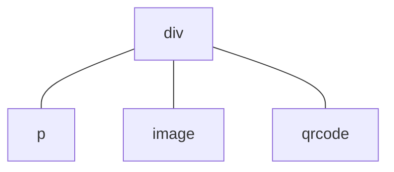

# Component reuse


Component reuse at the application level is mainly implemented by custom components.


## subcomponent


Suppose the structure in the `<template>` tag of a certain [UX files](/framework/component/README.md#ux-文件) describes the organization of the interface, e.g.
``` html
<template>
  <div>
    <p>text</p>
    <image src="path/to/image.png" />
    <qrcode value="hello world!" />
  </div>
</template>
```
Corresponds to the following component tree structure at runtime:

This component tree has a parent node `div` and $3$ child nodes `p`, `image` and `qrcode`. The `div` component is the outermost component in the `<template>` tag. We call this component the **root component**. Sometimes components are not unique, for example:
``` html
<template>
  <p>text</p>
  <image src="path/to/image.png" />
  <qrcode value="hello world!" />
</template>
```
There are 3 root components in. In addition, using [`for` directive](/framework/commands/for.md) may also cause multiple root component instances, such as
``` html
<template>
  <p for="x in ['one', 'two', 'three']">
    label: {{x}}
  </p>
</template>
```
Will be rendered as $3$ `p` component instances.