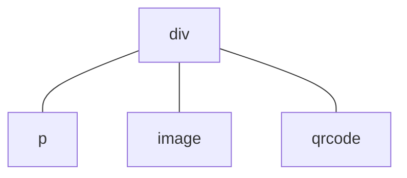

# Component Reuse

Component reuse at the application level is primarily implemented through custom components.

## Child Components

Suppose the structure within the `<template>` tag of a [UX file](./README.md#ux-files) describes the organizational structure of the interface, for example:
``` html
<template>
  <div>
    <p>text</p>
    <image src="path/to/image.png" />
    <qrcode value="hello world!" />
  </div>
</template>
```
At runtime, this corresponds to the following component tree structure:

This component tree has one parent node `div` and $3$ child nodes: `p`, `image`, and `qrcode`. The `div` component is the outermost component in the `<template>` tag; we call such a component a **root component**. Sometimes root components are not unique, for example:
``` html
<template>
  <p>text</p>
  <image src="path/to/image.png" />
  <qrcode value="hello world!" />
</template>
```
contains 3 root components. Additionally, using the [`for` command](../commands/for.md) may also result in multiple root component instances, for example:
``` html
<template>
  <p for="x in ['one', 'two', 'three']">
    label: {{x}}
  </p>
</template>
```
will be rendered as $3$ `p` component instances.
