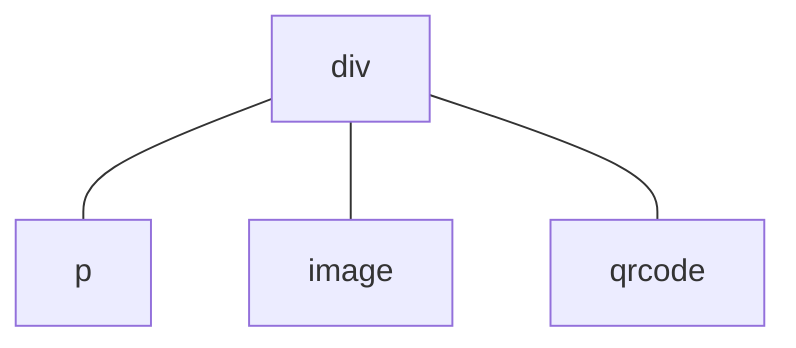

# 组件复用

应用层面的组件复用主要由自定义组件来实现。

## 子组件

假设某个 [UX 文件](/framework/component/README.md#ux-文件)的 `<template>` 标签中的结构描述界面的组织结构，例如
``` html
<template>
  <div>
    <p>text</p>
    <image src="path/to/image.png" />
    <qrcode value="hello world!" />
  </div>
</template>
```
在运行时对应以下组件树结构：

这颗组件树有一个父节点 `div` 和 $3$ 个子节点 `p`、`image` 和 `qrcode`。`div` 组件是 `<template>` 标签中最外层的组件，我们把这种组件称为**根组件**。跟组件有时候不是唯一的，例如：
``` html
<template>
  <p>text</p>
  <image src="path/to/image.png" />
  <qrcode value="hello world!" />
</template>
```
中有 3 个根组件。此外使用 [`for` 指令](/framework/commands/for.md)也可能造成多个根组件实例，例如
``` html
<template>
  <p for="x in ['one', 'two', 'three']">
    label: {{x}}
  </p>
</template>
```
会被渲染为 $3$ 个 `p` 组件实例。
